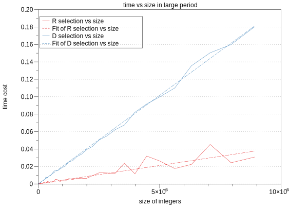
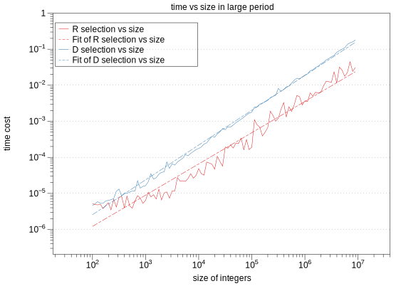
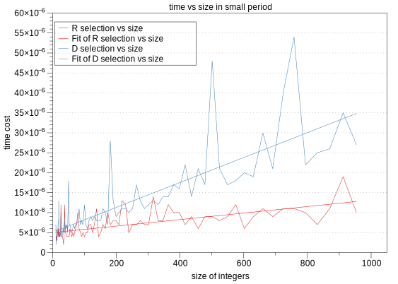
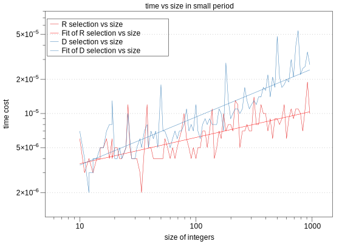

#Performances of Two Selection Algorithm

> Bingcheng HU
>
> 516021910219

## Introduction

In order to study the performances of these two selection algorithms, I generated different size of arrays and compared the running speed of them. Small size of arrays were run for several times so that the result can be more accurate.

## Comparison of algorithms

There is no limitation of runtime for all algorithms, because all these two algorithms have similar time complexity $O(n)$. Then I used DataGrapg to plot two graphs, one of small test cases, and another of all cases.

### Loop several times

With this loop function we can run it for 100 times so that the result can be more accurate. (Please check `performance.cpp`)

```c++
long time_all = 0;
for (int io = 0; io < 100; ++io)
{
    int i_th_num = lines*(io/(100));
    int arr_copy[lines];
    //use deep copy to make arr_copy evry turn
    memset(arr_copy,0, lines*sizeof(int));
    memcpy(arr_copy,arr, lines*sizeof(int));
    start = clock();
    fn[i](arr_copy, lines, i_th_num);
    end = clock();
    time_all += (end - start);
}
cout<<"Sort algorithm is ["<<sortName[i]<<"],";
double time_run =  (double)time_all / CLOCKS_PER_SEC / 100;
cout << "Running time: " <<time_run<< endl;
```

I generated different arrays of random integers with different sizes. Then I applied my selection algorithms to these arrays. Note the that runtime also depends on the specified order 𝑖. To eliminate the dependency on 𝑖, for a given array, I chose multiple 𝑖’s, run my algorithm over all these 𝑖’s, and report the average runtime over all 𝑖’s by `double time_run =  (double)time_all / CLOCKS_PER_SEC / 100;`.

###test

You can run `make test0` and `make test1` to test the program.

1. With `// #define SELECTION_DEBUG`


```bash
bogon:answer bingcheng$ make test0
g++ -std=c++11 -O3 -Wall -o generate gen_rand.cpp
g++ -std=c++11 -O3 -g -Wall -c main.cpp
g++ -std=c++11 -O3 -g -Wall -c selection.cpp
g++ -std=c++11 -O3 -g -Wall -o main main.o selection.o
./generate 0 40000 2000 > input.data
./main < input.data
The order-2000 item is -1932064068
bogon:answer bingcheng$ make test1
g++ -std=c++11 -O3 -Wall -o generate gen_rand.cpp
g++ -std=c++11 -O3 -g -Wall -o main main.o selection.o
./generate 1 40000 2000 > input.data
./main < input.data
The order-2000 item is -1932064068
```

2. With ` #define SELECTION_DEBUG`

```bash
bogon:answer bingcheng$ make test0
g++ -std=c++11 -O3 -Wall -o generate gen_rand.cpp
g++ -std=c++11 -O3 -g -Wall -c main.cpp
g++ -std=c++11 -O3 -g -Wall -o main main.o selection.o
./generate 0 40000 2000 > input.data
./main < input.data
selection algorithm is [R selection],
RunTime:0.000509
#[2000]smallest：[-1932064068], real:[-1932064068]
The order-2000 item is -1932064068
bogon:answer bingcheng$ make test1
g++ -std=c++11 -O3 -Wall -o generate gen_rand.cpp
g++ -std=c++11 -O3 -g -Wall -o main main.o selection.o
./generate 1 40000 2000 > input.data
./main < input.data
selection algorithm is [D selection],
RunTime:0.000941
#[2000]smallest：[-1932064068], real:[-1932064068]
The order-2000 item is -1932064068
```

You can get the real ith smallest and the selection ith smallest along with the runtime.

### Big data analysis

From **Figure 1**, all these line looks similar, so it's meaning less. So we make *log* at both *x* and *y* axis. As **Figure 2** shows,  we can find that both Random Selection and Deterministic Selection Algorithm have the runtime $O(n)$, and they are parallel when the size of the numbers is larger than $10^4$.



As Figure 2 shows below, Rselection is not stable because the line of it is not as straight as Dselection. Moreover, Rselection is faster than Dselection. 



So What happend when  the size of the numbers is smaller than $10^3$? it seems that these two lines are connected to each other. Let's see the `Small data analys is`.

### Small data analysis

From **Figure 4** we can see that when the data size is small, it's so hard to recognize the runtime because the datas are so unstable. There are so many data hopping all the time, though I used `Loop several times` in my code, it doesn't work because the performance of my computer is not stable.



Because these two lines are so similar, which means that we can use any of them when the number of datas are small.



#### scv Table

You can get full CSV table at [HERE](https://github.com/bingcheng1998/VE281/blob/master/Programming-Assignment/Programming-Assignment-2/answer/data_large.csv).

This table was generated by MacBook Pro 2015, i5, 256G.

|      | size    | R selection | D selection |      |
| ---- | ------- | ----------- | ----------- | ---- |
|      | 100     | 4.2e-06     | 8.4e-06     |      |
|      | 112     | 2.8e-06     | 6.4e-06     |      |
|      | 125     | 2.8e-06     | 1.66e-05    |      |
|      | 141     | 3.8e-06     | 6.6e-06     |      |
|      | 158     | 2.6e-06     | 6.6e-06     |      |
|      | 177     | 4.2e-06     | 6.6e-06     |      |
|      | 199     | 3.6e-06     | 8e-06       |      |
|      | 223     | 4e-06       | 8e-06       |      |
|      | 251     | 6e-06       | 9e-06       |      |
|      | 281     | 7e-06       | 1.38e-05    |      |
|      | ...     | ...         | ...         |      |
|      | 1778279 | 0.0146598   | 0.0363128   |      |
|      | ...     | ...         | ...         |      |
|      | 7943282 | 0.0283762   | 0.157991    |      |
|      |         |             |             |      |

### check memory leakage

```bash
==6463== LEAK SUMMARY:
==6463==    definitely lost: 0 bytes in 0 blocks
==6463==    indirectly lost: 0 bytes in 0 blocks
==6463==      possibly lost: 0 bytes in 0 blocks
==6463==    still reachable: 72,704 bytes in 1 blocks
==6463==         suppressed: 0 bytes in 0 blocks
==6463== Reachable blocks (those to which a pointer was found) are not shown.
```

No memory leakage.

## Conclution

According to the `data analysis`, Dselect is not as good as Rselect in practice, because it has worse constants and it's not in-place.

With worse constants it will cost more time and you can find that in *Figure 1*. It's not in-place so it will cost more time to acquire for datas, which is inefficiency.

So at most conditions, we should use Rselect in practice.

## Appendix

### The project files

#### selection.h

```c++
#ifndef SELECTION_H
#define SELECTION_H

int random_selection(int* arr, const int n, const int order);
// Randomized selection algorithm
// MODIFIES: *arr
// EFFECTS: select i-th smallest element in the array

int deterministric_selection(int* arr, const int n, const int order);
// Deterministic selection algorithm
// MODIFIES: *arr
// EFFECTS: select i-th smallest element in the array

#endif
```

#### selection.cpp

```c++
#include <iostream>
#include <cstdlib>
#include <cassert>
#include <ctime>
#include "selection.h"

using namespace std;

static void int_append(int *arrA, const int *arrB, const int s){
	// MODIFIES: *arrA
    // EFFECTS: append first "s" int in arrB tp the biginning if arrA.
	assert(s >= 0);
	if(s == 0) return;
	for (int i = 0; i < s; ++i)
	{
		arrA[i] = arrB[i];
	}
}

static int random_pivot(int* arr, const int n){
// Choose pivot p from arr uniformly at random;
// Partition arr using pivot p;
// Let j be the index of p, return j;
	const int size = n;
	int BL = 0, BR = size-1;
	int * B = new int[size];
	int * A = arr;
	srand((unsigned)time(NULL));
	const int pivotat = rand()%size;
	const int t = A[pivotat];
	for (int i = 0; i < size; ++i)
	{
		if(i == pivotat) continue;
		if(A[i] > t) B[BR--] = A[i];
		else B[BL++] = A[i];
	}
	assert(BL == BR);
	B[BL] = t;
	int_append(A, B, size);
	delete[] B;
	return BL;
}

static void insertion_sort(int *arr, const int n){
// MODIFIES: *arr
// EFFECTS: sort integers arr[] in ascending order with insertion_sort.
	for (int i = 1; i < n; ++i)
	{
		int t = arr[i];
		int j = i;
		while (j >= 1)
        {
            if (arr[j - 1] > t)
            {
                arr[j] = arr[j - 1];
                j--;
            }
            else break;
        }
		arr[j] = t;
	}
}

static int Deterministic_pivot_helper(int* arr, int n){

	if(n == 1) return arr[0]; 
	int full_bucket = n/5;
	int arr_medians_size = full_bucket+(n%5+4)/5;
	int* arr_medians = new int [arr_medians_size];
	int incomplete_bucket = arr_medians_size - full_bucket;
	for (int i = 0; i < full_bucket; ++i)
	{
		int* arr_break_5 = arr + i*5;
		insertion_sort(arr_break_5, 5);
		arr_medians[i] = arr_break_5[2];
	}
	if (incomplete_bucket != 0)
	{
		int incomplete_bucket_size = n%5;
		int* arr_break_5 = arr + full_bucket*5;
		insertion_sort(arr_break_5, incomplete_bucket_size);
		arr_medians[full_bucket] = arr_break_5[incomplete_bucket_size/2];
	}
	int pivot = Deterministic_pivot_helper(arr_medians, arr_medians_size);
	return pivot;
}

static int partition_array(int *arr, const int n, const int pivot){
	// MODIFIES: *arr
	// EFFECTS: choose a pivotat then Move pivot to its correct place in the array.
	const int size = n;
	int BL = 0, BR = size-1;
	int * B = new int[size];
	int * A = arr;
	const int t = pivot;
	for (int i = 0; i < size; ++i)
	{
		if(A[i] == t) continue;
		if(A[i] > t) B[BR--] = A[i];
		else B[BL++] = A[i];
	}
	assert(BL <= BR);
	
	for (int i = BL; i <= BR; ++i)
	{
		B[i] = t;
	}
	int_append(A, B, size);
	delete[] B;
	return BL;
}

static int Deterministic_pivot(int* arr, int n){
// Choose pivot p from arr uniformly at deterministic;
// Partition arr using pivot p;
// Let j be the index of p, return j;
	int pivot = Deterministic_pivot_helper(arr, n);
	int j = partition_array (arr, n, pivot);
	return j;
}

int selection_fun(int* arr, const int n, const int order, int (*fn)(int*, const int)){
	if(n == 1) return arr[0];
	int j = fn(arr, n);
	if(j == order) return arr[order];
	if(j > order) {
		int* arr_left = arr;
		int length = j;
		return selection_fun(arr_left, length, order, fn);
	}
	else{
		int* arr_right = arr + j + 1;
		int length = n - j - 1;
		return selection_fun(arr_right, length, order-j-1, fn);
	}
}

int random_selection(int* arr, const int n, const int order){
	return selection_fun(arr, n, order, random_pivot);
}

int deterministric_selection(int* arr, const int n, const int order){
	return selection_fun(arr, n, order, Deterministic_pivot);
}
```

####  main.cpp

```c++
#include <iostream>
#include <cstdlib>
#include <assert.h>
#include <ctime>
#include "selection.h"

#define SELECTION_WAY_SIZE 2
// #define SELECTION_DEBUG

using namespace std;

const string selectionName[] = {
	"R selection","D selection","ERROR_SELECTION_Name"
};

#ifdef SELECTION_DEBUG
void insertion_sort(int *arr, const int n){
	for (int i = 1; i < n; ++i)
	{
		int t = arr[i];
		int j = i;
		while (j >= 1)
        {
            if (arr[j - 1] > t)
            {
                arr[j] = arr[j - 1];
                j--;
            }
            else break;
        }
		arr[j] = t;
	}
}
#endif


int main(int argc, char *argv[]) {
	int (*const fn[SELECTION_WAY_SIZE])(int*, const int, const int) = {
        random_selection,
        deterministric_selection
    };
    int selection_algorithm;
	cin >> selection_algorithm;
	assert(selection_algorithm >= 0 && selection_algorithm < SELECTION_WAY_SIZE);
	#ifdef SELECTION_DEBUG
	cout<<"selection algorithm is ["<<selectionName[selection_algorithm]<<"],"<<endl;
	#endif

	int n;
	cin >> n;
	int order;
	cin >> order;
	int *arr = new int[n];
	for (int i = 0; i < n; ++i)
	{
		cin>>arr[i];
	}
	int i_th_small;
	clock_t start, end;
	start = clock();
	i_th_small = fn[selection_algorithm](arr, n, order);
	end = clock();

	#ifdef SELECTION_DEBUG
	int arr_copy[n];
	//use deep copy to make arr_copy evry turn
	memset(arr_copy,0, n*sizeof(int));
	memcpy(arr_copy,arr, n*sizeof(int));
	insertion_sort(arr_copy, n);
	cout << "RunTime:" << (double)(end - start) / CLOCKS_PER_SEC << endl;
	cout << "#["<<order<<"]smallest：["<<i_th_small<<"], real:["<<arr_copy[order]<<"]"<<endl;
	#endif
	cout<<"The order-"<<order<<" item is "<<i_th_small<<endl;
	delete[] arr;
	return 0;
}
```

#### Makefile

```makefile
all: main.o selection.o
	g++ -std=c++11 -O3 -g -Wall -o main main.o selection.o

auto: make_auto
	./autogen

make_auto: auto_gen.o
	g++ -std=c++11 -O3 -g -Wall -o autogen auto_gen.o

auto_gen.o: auto_gen.cpp
	g++ -std=c++11 -O3 -g -Wall -c auto_gen.cpp

t: make_test
	./test

make_test: simple_test.o selection.o
	g++ -std=c++11 -O3 -g -Wall -o test simple_test.o selection.o

simple_test.o: simple_test.cpp
	g++ -std=c++11 -O3 -g -Wall -c simple_test.cpp

test0: gen all
	./generate 0 40000 2000 > input.data
	./main < input.data

test1: gen all
	./generate 1 40000 2000 > input.data
	./main < input.data

gen:
	g++ -std=c++11 -O3 -Wall -o generate gen_rand.cpp

p: perf
	./perform 

perf: performance.o selection.o
	g++ -std=c++11 -O3 -g -Wall -o perform performance.o selection.o

performance.o: performance.cpp
	g++ -std=c++11 -O3 -g -Wall -c performance.cpp

main.o: main.cpp
	g++ -std=c++11 -O3 -g -Wall -c main.cpp

selection.o: selection.cpp
	g++ -std=c++11 -O3 -g -Wall -c selection.cpp
	
v:
	valgrind --leak-check=full ./main < input.data

tar:
	tar czvf p2.tar main.cpp selection.cpp selection.h p2.pdf

clean:
	rm -f ./main *.o *.data test generate autogen perform

```

#### auto_gen.cpp

```c++
#include <iostream>
#include <stdlib.h>
#include <sstream>
#include <assert.h>
#include <fstream>
#include <math.h>
using namespace std;
int main(int argc, char *argv[]) {
	ofstream oFile;

	for (int i = 0; i < 100; ++i)
	{
		ostringstream path_stream;
		path_stream<<"./data_file/"<<i<<".data";
		oFile.open(path_stream.str());
		double k = 1.0 + 2.0/100*(i);
		int ek = pow(10, k);
		cerr<<ek<<", ";

		oFile<<0<<endl;
		oFile<<ek<<endl;
		oFile<<0<<endl;
		for (int i = 0; i < ek; ++i)
		{
			int k = mrand48();
			oFile << k <<endl;
		}
		oFile.close();
	}
}
```

Generated files look like this.


#### performance.cpp

This program will produce a CSV table as 3.1.7 shows.

```c++
#include <iostream>
#include <iomanip>
#include <sstream>
#include <cstdlib>
#include <assert.h>
#include <ctime>
#include <fstream>
#include "selection.h"

using namespace std;

#define SELECTION_WAY_SIZE 2
#define file_num 100
#define LOOP_TIME 40
// #define SORT_DEBUG

void debug_print(char TAG, string deb_string){
	if(TAG == 'v') cerr<< deb_string;
}

void   Delay(int   time){ 
	clock_t   now   =   clock(); 
	while(   clock()   -   now   <   time   ); 
} 

const string selectionName[] = {
	"R selection","D selection","ERROR_SELECTION_Name"
};

bool safe_open_file(ifstream& i_file, string file_name){
	ostringstream debug_stream;
	i_file.open(file_name.c_str());
	if (i_file.fail()) {
		cout<<"Error: Cannot open file "<< file_name<<"!"<<endl; 
		exit(0);
	}
	debug_stream<<"file opened success!"<<endl;
	debug_print('v', debug_stream.str());
	debug_stream.clear();
	return true;
}

static int int_size[] = {
	10, 10, 10, 11, 12, 12, 13, 13, 14, 15, 15, 16, 17, 18, 19, 19, 20, 21, 22, 23, 25, 26, 27, 28, 30, 31, 33, 34, 36, 38, 39, 41, 43, 45, 47, 50, 52, 54, 57, 60, 63, 66, 69, 72, 75, 79, 83, 87, 91, 95, 100, 104, 109, 114, 120, 125, 131, 138, 144, 151, 158, 165, 173, 181, 190, 199, 208, 218, 229, 239, 251, 263, 275, 288, 301, 316, 331, 346, 363, 380, 398, 416, 436, 457, 478, 501, 524, 549, 575, 602, 630, 660, 691, 724, 758, 794, 831, 870, 912, 954 };

bool jump_j[] = {false, false,false,false,false,false};

int main(int argc, char *argv[]) {
	int (*const fn[SELECTION_WAY_SIZE])(int*, const int, const int) = {
        random_selection,
        deterministric_selection
    };

	clock_t start, end;
	ofstream outFile;
	outFile.open("data.csv", ios::out);
	outFile << "size"<<","<<selectionName[0]<<","<<selectionName[1]<<","<<endl;
	for (int j = 0; j < file_num; ++j)
	{
		ifstream iFile;
		
		
		ostringstream path_stream;
		path_stream<<"./data_file/"<<j<<".data";
		safe_open_file(iFile, path_stream.str());
		int lines;
		iFile >> lines;
		iFile >> lines;
		int meanning_less;
		iFile >> meanning_less;

		
		int *arr = new int[lines];
		int baz;
		for (int i = 0; i < lines; ++i)
		 {
		 	iFile >> baz;
		 	arr[i] = baz;
		 } 
		outFile << int_size[j]<<",";
		for (int i = 0; i < SELECTION_WAY_SIZE; ++i)
		{
			if(jump_j[i] == true){
				outFile << ""<<",";
				cerr<<"jump "<<selectionName[i]<<" with "<<int_size[j]<<" size!"<<endl;
				continue;
			}
			if(int_size[j] < 1000){
				cerr<<"delay at "<<int_size[j]<<" size"<<endl;
			 	Delay(1000);
			} else Delay(500);


			// int arr_copy[lines];
			// //use deep copy to make arr_copy evry turn
			// memset(arr_copy,0, lines*sizeof(int));
			// memcpy(arr_copy,arr, lines*sizeof(int));
			// start = clock();
			// fn[i](arr_copy, lines, 0);
			// end = clock();

			long time_all = 0;
            for (int lo = 0; lo < LOOP_TIME; lo++)
            {
                int arr_copy[lines];
                //use deep copy to make arr_copy evry turn
                memset(arr_copy,0, lines*sizeof(int));
                memcpy(arr_copy,arr, lines*sizeof(int));
                start = clock();
                fn[i](arr_copy, lines, 0);
                end = clock();
                time_all += (end - start);
            }


			cout<<"Sort algorithm is ["<<selectionName[i]<<"],";
			double time_run =  (double)time_all / CLOCKS_PER_SEC / LOOP_TIME;
			cout << "Running time: " <<time_run<< endl;
			if (time_run >= 24.0)
			{
				jump_j[i] = true;
			}
			outFile << time_run<<",";
		}
		outFile <<endl;


		iFile.close();
		delete[] arr;
	}
	outFile.close();
	return 0;
}
```

##DataGraph

I used [DataGraph](http://www.visualdatatools.com/DataGraph/) to generate images on MacBook Pro.


