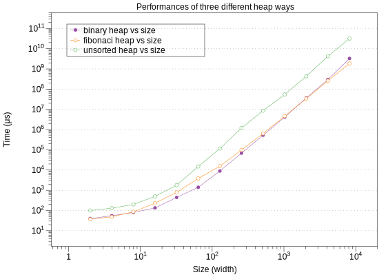

# Priority Queue and its Application

##Motivation 

This project will give you experience in implementing priority queues using C++. You will also empirically study the efficiency of different implementations. 

##Project Overview 

In this project, you are given a rectangular grid of cells. Each cell has a number indicating its weight, which is the cost of passing through the cell (In Fig.1, the color of the cell symbolizes its weight). You can assume the weights are positive integers. The input will give you the starting coordinate and the ending coordinate. As figure 1 shows, your task is to use priority queue to find the shortest path from the source cell to the ending cell. 

<div align=center></div>

## Input

 You will read from the standard input. (For the ease of testing, you can write each test case in 

a file and then use Linux file redirection function “<” to read from the file.) 

The format of the input is as follows: 

```
<width m>
<height n>
<Start x> <Start y>
<End x> <End y>
<W(0,0)> <W(1,0)> ... <W(m-1,0)>
...
<W(0,n-1)> <W(1,n-1)> ... <W(m-1,n-1)>
```

The first and the second line give the width 𝑚 and the height 𝑛 of the grid, respectively. They are positive integers. The third and the fourth line give the starting coordinate and the ending coordinate, respectively. They are non-negative integers within the valid range. The upper left corner has the coordinate (0, 0). The x-coordinate increases from left to right and the y-coordinate increases from top to bottom. The remaining lines give the weights of the cells in the grid. They represent a two dimensional array of 𝑛 rows and 𝑚 columns, as shown above. 𝑊(𝑖,𝑗) is the weight of the cell at coordinate (𝑖,𝑗) (0 ≤ 𝑖 ≤ 𝑚 − 1,0 ≤ 𝑗 ≤ 𝑛 − 1). The weights are all positive integers. 

For example, we have an input: 

```ruby
4
4
00
33 
5123 
2156 
4111
3605
```

It specifies a grid of width 4 and height 4. We want to find the shortest path form point (0, 0), which has weight 5, to the point (3, 3), which has weight 5. With `draw boxes.py` you can draw the figure below. 

<div align=center></div>

## Algorithm

Below is the pseudo-code of the algorithm:

```perl
Let PQ be a priority queue;
start_point.pathcost = start_point.cellweight;
Mark start_point as reached;
PQ.enqueue(start_point);
while(PQ is not empty) {
    C = PQ.dequeueMin(); // The key is cell’s pathcost
    for each neighbor N of C that has not been reached {
        N.pathcost = C.pathcost + N.cellweight;
        mark cell N as reached;
        mark the predecessor of N as C;
        // I.e., N is reached from C.
        if(end_point == N) {
            trace_back_path(); // Trace and print the path
                                // through predecessor info
			return; 
		}        
		else PQ.enqueue(N);
    }
}

```

<div align=left></div>
<div align=center></div>

## Command Line Input 

Your program should be named main. It should take the following case-sensitive command-line options: 

1. -i, --implementation: a required option. It changes the priority queue implementation at runtime. An argument should immediately follow that option, being BINARY, UNSORTED, or FIBONACCI to indicate the implementation (see Section VII Implementations of Priority Queues). 
2. -v, --verbose: an optional flag that indicates the program should print additional outputs (see Section VI Output). 

Examples of legal command lines: 

-  ./main --implementation BINARY < infile.txt

- ./main --verbose -i UNSORTED < infile.txt > outfile.txt 

- ./main --verbose -i FIBONACCI 

Note that the first two calls read the input stored in the infile.txt. The third call reads from the standard input. 

Examples of illegal command lines: 

- ./main < infile.txt
   No implementation is specified. Implementation is a required option. 

-  ./main --implementation BINARY infile.txt 

You are not using input redirection “<” to read from the file infile.txt. 

We require you to realize the above requirement using the function **getopt_long**. See its usage and an example at http://www.gnu.org/software/libc/manual/html_node/Getopt.html#Getopt 

In testing your program, we will supply correct command-line inputs, but you are encouraged to detect and handle errors in the command-line inputs. 

## Three Heap Algorithm

### 1. Unsorted heap

| operator    | time complexity |
| ----------- | --------------- |
| enqueue     | O(1)            |
| dequeue min | O(N)            |
| get min     | O(N)            |

Here we can use `std::min_element` and `std::distance` as [here](https://en.cppreference.com/w/cpp/algorithm/min_element) says. Below is an example.

```cpp
#include <algorithm>
#include <iostream>
#include <vector>
int main(){
    std::vector<int> v{3, 1, 4, 1, 5, 9};
    std::vector<int>::iterator result = std::min_element(std::begin(v), std::end(v));
    std::cout << "min element at: " << std::distance(std::begin(v), result);
}
```

### 2. Binary Heap

| operator    | time complexity |
| ----------- | --------------- |
| enqueue     | O(logN)         |
| dequeue min | O(logN )        |
| get min     | O(1)            |

A small complete binary tree stored in an array is arranged as below as an array.

<div align=center></div>

According to the courseware, we know:

1. The first element is stored at index 1.

2. A node at index 𝑖 (𝑖 ≠ 1) has its parent at index

3. Assume the number of nodes is 𝑛. A node at index 𝑖 (2𝑖 ≤ 𝑛) has its left child at 2𝑖.
   ​	If 2𝑖 > 𝑛, it has no left child. 

4. A node at index 𝑖 (2𝑖 + 1 ≤ 𝑛) has its right child at 2𝑖 + 1. 

   ​	If 2𝑖 + 1 > 𝑛, it has no right child. 

<div align=center></div>

To make the first element to be stored at index 1 instead of index 0, we add `data.push_back(TYPE())` at the beginning of the constructor, such that we can make the program much simple and easy to write.

#### caution!

Persucode of `dequeueMin`  is shown as below.

```c++
Item minHeap::dequeueMin() {
  swap(heap[1], heap[size--]);
  percolateDown(1);
  return heap[size+1];
}
```

Here `size--` means we need to decrease `size` by 1 at function `percolateDown`.

### 3. Fibonacci Heap

| operator    | time complexity |
| ----------- | --------------- |
| enqueue     | O(1)            |
| dequeue min | O(logN )        |
| get min     | O(1)            |

A [Fibonacci heap](https://en.wikipedia.org/wiki/Fibonacci_heap) is a collection of trees satisfying the minimum-heap property, that is, the key of a child is always greater than or equal to the key of the parent. 

<div align=center></div>

According to `Pseudo-code for Fibonacci heap` at appendix, we can find that fot Fibonacci heap we need `n, min, degree, key, child, parent`.

> n stores the number of elements in the heap
>
> min refers to the minimal element in the heap

so we can constract this structure as private part.

```c++
	struct node
    {
        TYPE val;
        typename std::list<fib_node> child;
        int degree=0;
    };
    typename std::list<fib_node> parent;
    typename std::list<fib_node>::iterator min;
    int n=0;
    TYPE empty_fib=TYPE();
```

##The Efficiency of Different Implementations

### Algorithm

You can check `gen_rand.cpp` and `performance.cpp` at appendix.

Part of tha makefile is shown below. you can run `$make gen` then `$make per`  to test it;


```ruby
gen: gen_rand.cpp
	g++ -std=c++11 -O2 -o gen_rand_matrix gen_rand.cpp
	./gen_rand_matrix > matrix.in

per: performance.cpp
	g++ -std=c++11 -O3 -o perform performance.cpp
	./perform < matrix.in > out.csv
```

The out put of `per` is `out.csv` and it's shown below

```tex
size	binary heap	fibonaci heap	unsorted heap
2	40	37	100
4	55	49	130
8	80	87	200
16	135	231	500
32	443	791	1800
64	1405	3849	15000
128	8964	15502	115502
256	68323	98871	1198871
512	528216	642127	8642127
1024	4149496	4618324	54618324
2048	36979493	34048446	434048446
4096	297947134	259392634	4259392634
8192	3297947134	1859392634	31859392634
```

### Result Analysis

With these data, we can draw the graph below with DataGraph, and you can check this software at appendix.



Combining the output and figure above, we can conclude the following points. 

1. For each priority queue, the run time increases as the size of the grid increases.
2. binary_heap, fib_heap have the similar running speed and the result satisfy the theory that they have the time complexity of O(log n) in enqueing, finding minimum and dequeing minimum. 
3. Unsorted_heap is slower than those three queues, because it have the time complexity of O(n) in finding minimum and dequeing minimum.
4. when the table size is very small, binary heap is faster than fib heap, while  when size is beteew $10\times 10$ and $10^3 \times  10^3$, fib heap is faster. But when size od gride is latger than $10^3$, binary heap is faster again.


## Appendix

### Example of Parsing Long Options with `getopt_long`

1. `getopt_long`

`c = getopt_long (argc, argv, "vti:", long_options, &option_index);`

`vti: ` means `-v` is single option while `-i` cannot show up alone, it should be like `-i FLAG_AFTER`, and in this program if we run some commands in the terminal:

```ruby
$make op
g++ -std=c++11 -O3 -o getop_test getop_test.cpp
$make test
./getop_test --implementation BINARY
option -i with value `BINARY'
verbose flag is disabled
./getop_test -i BINARY
option -i with value `BINARY'
verbose flag is disabled
./getop_test --verbose -i UNSORTED
option -i with value `UNSORTED'
verbose flag is set
./getop_test --v -i UNSORTED
option -i with value `UNSORTED'
verbose flag is set
./getop_test --verbose -i FIBONACCI
option -i with value `FIBONACCI'
verbose flag is set
./getop_test -test -i FIBONACCI
option -t
getop_test: invalid option -- e
getop_test: invalid option -- s
option -t
option -i with value `FIBONACCI'
verbose flag is disabled
```

2. get_long_opt_test.cpp

```cpp
#include <iostream>
#include <getopt.h>

using namespace std;

/* Flag set by ‘--verbose’. */
static int verbose_flag;

int main (int argc, char **argv)
{
  int c;
  string argument;
  while (1)
    {
      static struct option long_options[] =
        {
          /* These options set a flag. */
          {"verbose", no_argument,       &verbose_flag, 1},
          {"brief",   no_argument,       &verbose_flag, 0},
          /* These options don’t set a flag.
             We distinguish them by their indices. */
          {"test",     			no_argument,       0, 't'},
          {"implementation",  	required_argument,       0, 'i'},
          {0, 0, 0, 0}
        };
      /* getopt_long stores the option index here. */
      int option_index = 0;

      c = getopt_long (argc, argv, "vti:",
                       long_options, &option_index);

      /* Detect the end of the options. */
      if (c == -1)
        break;

      switch (c)
        {
        case 0:
          /* If this option set a flag, do nothing else now. */
          if (long_options[option_index].flag != 0)
            break;
          printf ("option %s", long_options[option_index].name);
          if (optarg)
            printf (" with arg %s", optarg);
          printf ("\n");
          break;

        case 't':
          printf ("option -t\n");
          break;

        case 'i':
          printf ("option -i with value `%s'\n", optarg);
          argument = optarg;
          break;

        case '?':
          /* getopt_long already printed an error message. */
          break;

        default:
          abort ();
        }
    }

  /* Instead of reporting ‘--verbose’
     and ‘--brief’ as they are encountered,
     we report the final status resulting from them. */
  if (verbose_flag)
    puts ("verbose flag is set");
  else puts("verbose flag is disabled");

  /* Print any remaining command line arguments (not options). */
  if (optind < argc)
    {
      printf ("non-option ARGV-elements: ");
      while (optind < argc)
        printf ("%s ", argv[optind++]);
      putchar ('\n');
    }

  exit (0);
}
```

3. Makefile

```ruby
op: getop_test.cpp
	g++ -std=c++11 -O3 -o getop_test getop_test.cpp

test:
	./getop_test --implementation BINARY
	./getop_test -i BINARY
	./getop_test --verbose -i UNSORTED
	./getop_test --v -i UNSORTED
	./getop_test --verbose -i FIBONACCI
	./getop_test -test -i BINARY
```

### draw boxes.py

```python
#!/usr/bin/env python
# -*- coding: utf-8 -*-

from tkinter import *
def drawboard(board,colors,startx=50,starty=50,cellwidth=50):
    width=2*startx+len(board)*cellwidth
    height=2*starty+len(board)*cellwidth
    canvas.config(width=width,height=height)
    for j  in range(len(board)):
        for i in range(len(board)):
 
            index=board[j][i]
            color=colors[6-index]
            cellx=startx+i*50
            celly=starty+j*50
            canvas.create_rectangle(cellx,celly,cellx+cellwidth,celly+cellwidth,
                fill=color,outline="black")
    canvas.update()
root=Tk()
canvas=Canvas(root,bg="white")
canvas.pack()
board=[ [5,1,2,3],
        [2,1,5,6],
        [4,1,1,1],
        [3,6,0,5]]
colors=['teal','lightseagreen','turquoise','paleturquoise','lightcyan','azure','white']
drawboard(board,colors)
root.mainloop()
```

### priority_queue.h

```c++
#ifndef PRIORITY_QUEUE_H
#define PRIORITY_QUEUE_H

#include <functional>
#include <vector>

// OVERVIEW: A simple interface that implements a generic heap.
//           Runtime specifications assume constant time comparison and
//           copying. TYPE is the type of the elements stored in the priority
//           queue. COMP is a functor, which returns the comparison result of
//           two elements of the type TYPE. See test_heap.cpp for more details
//           on functor.
template<typename TYPE, typename COMP = std::less<TYPE> >
class priority_queue {
public:
  typedef unsigned size_type;

  virtual ~priority_queue() {}

  // EFFECTS: Add a new element to the heap.
  // MODIFIES: this
  // RUNTIME: O(n) - some implementations *must* have tighter bounds (see
  //          specialized headers).
  virtual void enqueue(const TYPE &val) = 0;

  // EFFECTS: Remove and return the smallest element from the heap.
  // REQUIRES: The heap is not empty.
  //           Note: We will not run tests on your code that would require it
  //           to dequeue an element when the heap is empty.
  // MODIFIES: this
  // RUNTIME: O(n) - some implementations *must* have tighter bounds (see
  //          specialized headers).
  virtual TYPE dequeue_min() = 0;

  // EFFECTS: Return the smallest element of the heap.
  // REQUIRES: The heap is not empty.
  // RUNTIME: O(n) - some implementations *must* have tighter bounds (see
  //          specialized headers).
  virtual const TYPE &get_min() const = 0;

  // EFFECTS: Get the number of elements in the heap.
  // RUNTIME: O(1)
  virtual size_type size() const = 0;

  // EFFECTS: Return true if the heap is empty.
  // RUNTIME: O(1)
  virtual bool empty() const = 0;

};

#endif //PRIORITY_QUEUE_H

```


### fib_heap.h

```c++
//
//  fib_heap.h
//  VE281 2018 Autumn
//  project3
//  Bingcheng HU
//
#ifndef FIB_HEAP_H
#define FIB_HEAP_H

#include <algorithm>
#include <cmath>
#include <list>
#include "priority_queue.h"

// OVERVIEW: A specialized version of the 'heap' ADT implemented as a
//           Fibonacci heap.
template<typename TYPE, typename COMP = std::less<TYPE> >
class fib_heap: public priority_queue<TYPE, COMP> {
public:
    typedef unsigned size_type;

    // EFFECTS: Construct an empty heap with an optional comparison functor.
    //          See test_heap.cpp for more details on functor.
    // MODIFIES: this
    // RUNTIME: O(1)
    fib_heap(COMP comp = COMP());

    // EFFECTS: Add a new element to the heap.
    // MODIFIES: this
    // RUNTIME: O(1)
    virtual void enqueue(const TYPE &val);

    // EFFECTS: Remove and return the smallest element from the heap.
    // REQUIRES: The heap is not empty.
    // MODIFIES: this
    // RUNTIME: Amortized O(log(n))
    virtual TYPE dequeue_min();

    // EFFECTS: Return the smallest element of the heap.
    // REQUIRES: The heap is not empty.
    // RUNTIME: O(1)
    virtual const TYPE &get_min() const;

    // EFFECTS: Get the number of elements in the heap.
    // RUNTIME: O(1)
    virtual size_type size() const;

    // EFFECTS: Return true if the heap is empty.
    // RUNTIME: O(1)
    virtual bool empty() const;

private:
    // Note: compare is a functor object
    COMP compare;

private:
    // Add any additional member functions or data you require here.
    // You may want to define a strcut/class to represent nodes in the heap and a
    // pointer to the min node in the heap.
    struct Node{
        TYPE key;
        unsigned int degree;
        Node *child;
        Node *parent;
        Node *left;
        Node *right;
        Node(TYPE t_value=TYPE()):
        key(t_value),parent(NULL),child(NULL),
        left(this),right(this),degree(0){}
    };
    unsigned int Node_count;
    Node *min;
    std::vector<Node*> root;
    TYPE empty_fib=TYPE();
    virtual void Insert2left(Node *origin_node, Node *new_node);
    virtual void Fibonacci_Heap_Link(Node *y,Node *x);
    virtual void Consolidate();

};

// Add the definitions of the member functions here. Please refer to
// binary_heap.h for the syntax.

template<typename TYPE, typename COMP>
void fib_heap<TYPE, COMP> ::Insert2left(Node *origin_node, Node *new_node) {
    if(origin_node!=NULL){
        new_node->left->right=new_node->right;
        new_node->right->left=new_node->left;
        origin_node->right->left=new_node;
        new_node->right=origin_node->right;
        origin_node->right=new_node;
        new_node->left=origin_node;
        new_node->parent=origin_node->parent;
        if(origin_node->parent!=NULL) origin_node->parent->degree+=1;
    }
}


template<typename TYPE, typename COMP>
void fib_heap<TYPE, COMP> ::Fibonacci_Heap_Link(Node *y,Node *x){
    unsigned int id;
    for(int i=0;i<root.size();i++){
        if(root[i]==y) id=i;
    }
    Node *N=root[id];
    root[id]=root[root.size()-1];
    root.pop_back();
    if(x->child==NULL){
        x->degree+=1;
        x->child=N;
        N->parent=x;
        N->left->right=N->right;
        N->right->left=N->left;
        N->left=N;
        N->right=N;
    }
    else Insert2left(x->child,y);
}

template<typename TYPE, typename COMP>
void fib_heap<TYPE, COMP> ::Consolidate() {
    int root_size = Node_count;
    std::vector<Node*> A(root_size,NULL);
    for(int i=0; i<root.size(); ++i){
        Node *x=root[i];
        unsigned int d=x->degree;
        while(A[d]!=NULL){
            Node *y=A[d];
            if(compare(y->key,x->key)){
                Node *N=x;
                x=y;
                y=N;
            }
            Fibonacci_Heap_Link(y,x);
            A[d]=NULL;
            d++;
        }
        A[d]=x;
    }
    this->min=NULL;
    for(int j=0;j<root.size();j++){
        Node *t=root[j];
        if(this->min==NULL) this->min=root[j];
        else if(compare( t->key,this->min->key)) 
            this->min=root[j];
    }
}

template<typename TYPE, typename COMP>
fib_heap<TYPE, COMP> ::fib_heap(COMP comp) {
    this->Node_count=0;
    compare = comp;
    this->min=NULL;
}

template<typename TYPE, typename COMP>
void fib_heap<TYPE, COMP> :: enqueue(const TYPE &val) {
    Node *N=new Node(val);
    N->degree=0;
    N->child=NULL;
    N->parent=NULL;
    if(this->min==NULL){
        root.push_back(N);
        this->min=N;
        N->right=N;
        N->left=N;
    }
    else{
        root.push_back(N);
        Insert2left(min,N);
        if(compare(N->key,this->min->key)) this->min=N;
    }
    this->Node_count+=1;
};


template<typename TYPE, typename COMP>
TYPE fib_heap<TYPE, COMP> :: dequeue_min(){
    TYPE key_out = min->key;
    Node *mid_node=this->min;
    if(mid_node!=NULL){
        if(mid_node->child!=NULL){
            Node *new_mid=mid_node->child;
            do{
                root.push_back(new_mid);
                new_mid->parent=NULL;
                new_mid=new_mid->right;
            }while(new_mid!=mid_node->child);
            new_mid->left->right=mid_node->right;
            mid_node->right->left=new_mid->left;
            new_mid->left=mid_node->left;
            mid_node->left->right=new_mid;
        }
        // delete mid_node;
        unsigned int id;
        for(int i=0;i<root.size();i++){
            if(root[i]==mid_node) id=i;
        }


        root.erase(root.begin()+id);
        // delete mid_node;
        this->Node_count-=1;
        if(this->Node_count==0)this->min=NULL;
        else Consolidate();
    }
    return key_out;
};

template<typename TYPE, typename COMP>
const TYPE &fib_heap<TYPE, COMP> :: get_min() const{
    if(this->empty())
    {
        return empty_fib;
    }
    return min->key;
};

template<typename TYPE, typename COMP>
unsigned fib_heap<TYPE, COMP> :: size() const {
    return Node_count;
}

template<typename TYPE, typename COMP>
bool fib_heap<TYPE, COMP> :: empty() const {
    return this->size()==0;
}

#endif //FIB_HEAP_H

```

### unsorted_heap.h

```c++
//
//  unsorted_heap.h
//  VE281 2018 Autumn
//  project3
//  Bingcheng HU
//
#ifndef UNSORTED_HEAP_H
#define UNSORTED_HEAP_H

#include <algorithm>
#include "priority_queue.h"

// OVERVIEW: A specialized version of the 'heap' ADT that is implemented with
//           an underlying unordered array-based container. Every time a min
//           is required, a linear search is performed.
template<typename TYPE, typename COMP = std::less<TYPE> >
class unsorted_heap: public priority_queue<TYPE, COMP> {
public:
  typedef unsigned size_type;

  // EFFECTS: Construct an empty heap with an optional comparison functor.
  //          See test_heap.cpp for more details on functor.
  // MODIFIES: this
  // RUNTIME: O(1)
  unsorted_heap(COMP comp = COMP());

  // EFFECTS: Add a new element to the heap.
  // MODIFIES: this
  // RUNTIME: O(1)
  virtual void enqueue(const TYPE &val);

  // EFFECTS: Remove and return the smallest element from the heap.
  // REQUIRES: The heap is not empty.
  // MODIFIES: this
  // RUNTIME: O(n)
  virtual TYPE dequeue_min();

  // EFFECTS: Return the smallest element of the heap.
  // REQUIRES: The heap is not empty.
  // RUNTIME: O(n)
  virtual const TYPE &get_min() const;

  // EFFECTS: Get the number of elements in the heap.
  // RUNTIME: O(1)
  virtual size_type size() const;

  // EFFECTS: Return true if the heap is empty.
  // RUNTIME: O(1)
  virtual bool empty() const;

private:
  // Note: This vector *must* be used in your heap implementation.
  std::vector<TYPE> data;
  // Note: compare is a functor object
  COMP compare;
private:
  // Add any additional member functions or data you require here.
  TYPE is_empty = TYPE();
};

template<typename TYPE, typename COMP>
unsorted_heap<TYPE, COMP> :: unsorted_heap(COMP comp) {
    compare = comp;
    // Fill in the remaining lines if you need.
}

template<typename TYPE, typename COMP>
void unsorted_heap<TYPE, COMP> :: enqueue(const TYPE &val) {
    // Fill in the body.
    data.push_back(val);
}

template<typename TYPE, typename COMP>
TYPE unsorted_heap<TYPE, COMP> :: dequeue_min() {
    // Fill in the body.
    if (empty()) return is_empty;
    auto min = std::min_element(data.begin(), data.end(), compare);
    int dis = std::distance(data.begin(), min);
    std::swap(data[dis], data.back());
    TYPE dequeue_min = std::move(data.back());
    data.pop_back();
    return dequeue_min;
}

template<typename TYPE, typename COMP>
const TYPE &unsorted_heap<TYPE, COMP> :: get_min() const {
    // Fill in the body.
    if (empty()) return is_empty;
    auto min = std::min_element(data.begin(), data.end(), compare);
    return *min;
}

template<typename TYPE, typename COMP>
bool unsorted_heap<TYPE, COMP> :: empty() const {
    // Fill in the body.
    return data.empty();
}

template<typename TYPE, typename COMP>
unsigned unsorted_heap<TYPE, COMP> :: size() const { 
    // Fill in the body.
    return data.size();
}

#endif //UNSORTED_HEAP_H

```

### main.cpp

```c++
//
//  main.cpp
//  VE281 2018 Autumn
//  project3
//  Bingcheng HU
//
#include <iostream>
#include <getopt.h>
#include "priority_queue.h"
#include "binary_heap.h"
#include "fib_heap.h"
#include "unsorted_heap.h"

using namespace std;
// static int verbose;

class point {
public:
    int x;
    int y;
    int cellweight=0;
    int cost=0;
    bool reached=false;
    point *predecessor=NULL;
    friend bool operator==(const point &p1,const point &p2)
    {
        return (p1.x==p2.x&&p1.y==p2.y&&p1.cellweight==p2.cellweight&&p1.cost==p2.cost&&p1.reached==p2.reached&&p1.predecessor==p2.predecessor);
    }
    friend ostream &operator<<(ostream &out, const point &p) {
        out << "(" << p.x << ", " << p.y << ")";
        return out;
    }
//     During a dequeueMin() operation, if multiple cells have the same smallest path
// cost, choose the cell with the smallest x-coordinate. Furthermore, if there are multiple
// cells with the same x-coordinate, choose the cell with the smallest y-coordinate.
    struct compare_t
    {
        bool operator()(const point &a, const point &b) const {
            if (a.cost != b.cost) return a.cost < b.cost;
            if (a.x != b.x) return a.x < b.x;
            return a.y < b.y;
        }
    };
};

void trace_back_path(point *p){
    if(p!=NULL){
        trace_back_path(p->predecessor);
        cout<<*p<<endl;
    }
    return;
}

int main(int argc,char* argv[])
{
    std::ios::sync_with_stdio(false);
    std::cin.tie(0);
//----------------- Get Operation-----------------
    string mode;
    int verbose = 0;
    while(true)
    {
        static struct option long_options[]=
        {
            {"verbose", no_argument,       0, 'v'},
            // {"v", no_argument,       &verbose, 1},
            // {"brief",   no_argument,       &verbose, 0},
          /* These options don’t set a flag.
             We distinguish them by their indices. */
            // {"test",              no_argument,       0, 't'},
            {"implementation",    required_argument,       0, 'i'},
            {0, 0, 0, 0}
        };
        int option_index = 0;
        int c=getopt_long(argc,argv,"vi:",long_options,&option_index);
              if (c == -1)
        break;

      switch (c)
        {
        case 0:
          /* If this option set a flag, do nothing else now. */
          if (long_options[option_index].flag != 0)
            break;
          // printf ("option %s", long_options[option_index].name);
          if (optarg)
            // printf (" with arg %s", optarg);
          // printf ("\n");
          break;

        case 'v':
          // printf ("option -t\n");
          verbose = 1;
          break;

        case 'i':
          // printf ("option -i with value `%s'\n", optarg);
          mode = optarg;
          break;

        case '?':
          /* getopt_long already printed an error message. */
          break;

        default:
          abort ();
        }
    }
    priority_queue<point,point::compare_t> *priority_q;
    if(mode=="BINARY")
    {
        priority_q=new binary_heap<point,point::compare_t>();
    }
    else if(mode=="UNSORTED")
    {
        priority_q=new unsorted_heap<point,point::compare_t>();
    }
    else if(mode=="FIBONACCI")
    {
        priority_q=new fib_heap<point,point::compare_t>();
    }
    else
    {
        exit(0);
    }
//-------------------get file input-----------------
    int x_length,y_length=0;
    cin>>x_length>>y_length;
    int start_x,start_y,end_x,end_y;
    cin>>start_x>>start_y>>end_x>>end_y;
    point point_A[y_length][x_length];
    for(int h=0;h<y_length;++h){
        for(int w=0;w<x_length;++w){
            cin>>point_A[h][w].cellweight;
        }
    }
    for(int h=0;h<y_length;++h){
        for(int w=0;w<x_length;++w){
            point_A[h][w].x=w;
            point_A[h][w].y=h;
            point_A[h][w].cost=point_A[h][w].cellweight;
        }
    }
//-------------------calculate path------------------
    point_A[start_y][start_x].reached=true;
    priority_q->enqueue(point_A[start_y][start_x]);
    int step=0;
    while(priority_q->empty()==false){
        point C=priority_q->dequeue_min();
        if(verbose==1){
            cout<<"Step "<<step<<endl;
            cout<<"Choose cell ("<<point_A[C.y][C.x].x<<", "<<point_A[C.y][C.x].y
            <<") with accumulated length "<<point_A[C.y][C.x].cost<<"."<<endl;
        }
        step++;
//      The visit of the neighbors starts form the right neighbor and then goes in the
// clockwise direction, i.e., right, down, left, up. For those cells on the boundary, they
// may not have a certain neighbor. Then you just skip it.
        int clockwise_x[4]={1,0,-1,0};
        int clockwise_y[4]={0,1,0,-1};
        for(int i=0;i<4;++i){
            int N_x=point_A[C.y][C.x].x+clockwise_x[i];
            int N_y=point_A[C.y][C.x].y+clockwise_y[i];
            if(N_x<0||N_x>x_length-1||
                N_y<0||N_y>y_length-1||
                point_A[N_y][N_x].reached==true) 
                continue;
            point_A[N_y][N_x].reached=true;
            point_A[N_y][N_x].cost=point_A[C.y][C.x].cost+point_A[N_y][N_x].cellweight;
            point_A[N_y][N_x].predecessor=&point_A[C.y][C.x];
            if(point_A[end_y][end_x].x==point_A[N_y][N_x].x&&point_A[end_y][end_x].y==point_A[N_y][N_x].y){
                if(verbose==1){
                    cout<<"Cell ("<<point_A[N_y][N_x].x<<", "<<point_A[N_y][N_x].y
                    <<") with accumulated length "<<point_A[N_y][N_x].cost<<" is the ending point."<<endl;
                }
                auto end_node = &point_A[end_y][end_x];
                cout<<"The shortest path from ("<<point_A[start_y][start_x].x<<", "
                <<point_A[start_y][start_x].y<<") to ("<<point_A[end_y][end_x].x
                <<", "<<point_A[end_y][end_x].y<<") is "<<point_A[N_y][N_x].cost<<"."<<endl;
                cout<<"Path:"<<endl;
                trace_back_path(&point_A[end_y][end_x]);
                delete priority_q;
                return 0;
            }
            else{
                priority_q->enqueue(point_A[N_y][N_x]);
                if(verbose==1){
                    cout<<"Cell ("<<point_A[N_y][N_x].x<<", "<<point_A[N_y][N_x].y
                    <<") with accumulated length "<<point_A[N_y][N_x].cost
                    <<" is added into the queue."<<endl;
                }
            }
        }
    }
    delete priority_q;
    return 0;
}
```

### performance.cpp

```c++
//
//  main.cpp
//  VE281 2018 Autumn
//  project3
//  Bingcheng HU
//
#include <iostream>
#include <getopt.h>
#include <tgmath.h>
#include "priority_queue.h"
#include "binary_heap.h"
#include "fib_heap.h"
#include "unsorted_heap.h"

using namespace std;
static int verbose;

class point {
public:
    int x;
    int y;
    int cellweight=0;
    int cost=0;
    bool reached=false;
    point *predecessor=NULL;
    friend bool operator==(const point &p1,const point &p2)
    {
        return (p1.x==p2.x&&p1.y==p2.y&&p1.cellweight==p2.cellweight&&p1.cost==p2.cost&&p1.reached==p2.reached&&p1.predecessor==p2.predecessor);
    }
    friend ostream &operator<<(ostream &out, const point &p) {
        out << "(" << p.x << ", " << p.y << ")";
        return out;
    }
//     During a dequeueMin() operation, if multiple cells have the same smallest path
// cost, choose the cell with the smallest x-coordinate. Furthermore, if there are multiple
// cells with the same x-coordinate, choose the cell with the smallest y-coordinate.
    struct compare_t
    {
        bool operator()(const point &a, const point &b) const {
            if (a.cost != b.cost) return a.cost < b.cost;
            if (a.x != b.x) return a.x < b.x;
            return a.y < b.y;
        }
    };
};

void trace_back_path(point *p){
    if(p!=NULL){
        trace_back_path(p->predecessor);
        // cout<<*p<<endl;
    }
    return;
}

void clean_matrix(point **point_A,int y_length, int x_length){
    for(int h=0;h<y_length;++h){
        for(int w=0;w<x_length;++w){
            point_A[h][w].x=w;
            point_A[h][w].y=h;
            point_A[h][w].cost=point_A[h][w].cellweight;
            point_A[h][w].reached = false;
        }
    }
}

clock_t test_time(point **point_A, int y_length, int x_length, int mode){
    int start_y = 0;
    int start_x = 0;
    int end_y = y_length-1;
    int end_x = x_length-1;
    clock_t start_t, end_t;
    start_t = clock();
    // cout<<"start at "<<start_t;
    priority_queue<point,point::compare_t> *priority_q;
    if(mode== 1) //"BINARY")
    {
        priority_q=new binary_heap<point,point::compare_t>();
    }
    else if(mode== 0) //"UNSORTED")
    {
        priority_q=new unsorted_heap<point,point::compare_t>();
    }
    else if(mode== 2) //"FIBONACCI")
    {
        priority_q=new fib_heap<point,point::compare_t>();
    }
    else
    {
        exit(0);
    }
    
    int verbose = 0;
    point_A[start_y][start_x].reached=true;
    priority_q->enqueue(point_A[start_y][start_x]);
    int step=0;
    while(priority_q->empty()==false){
        point C=priority_q->dequeue_min();
        if(verbose==1){
            cout<<"Step "<<step<<endl;
            cout<<"Choose cell ("<<point_A[C.y][C.x].x<<", "<<point_A[C.y][C.x].y
            <<") with accumulated length "<<point_A[C.y][C.x].cost<<"."<<endl;
        }
        step++;
//      The visit of the neighbors starts form the right neighbor and then goes in the
// clockwise direction, i.e., right, down, left, up. For those cells on the boundary, they
// may not have a certain neighbor. Then you just skip it.
        int clockwise_x[4]={1,0,-1,0};
        int clockwise_y[4]={0,1,0,-1};
        for(int i=0;i<4;++i){
            int N_x=point_A[C.y][C.x].x+clockwise_x[i];
            int N_y=point_A[C.y][C.x].y+clockwise_y[i];
            if(N_x<0||N_x>x_length-1||
                N_y<0||N_y>y_length-1||
                point_A[N_y][N_x].reached==true) 
                continue;
            point_A[N_y][N_x].reached=true;
            point_A[N_y][N_x].cost=point_A[C.y][C.x].cost+point_A[N_y][N_x].cellweight;
            point_A[N_y][N_x].predecessor=&point_A[C.y][C.x];
            if(point_A[end_y][end_x].x==point_A[N_y][N_x].x&&point_A[end_y][end_x].y==point_A[N_y][N_x].y){
                
                auto end_node = &point_A[end_y][end_x];
                cerr<<"cost = "<< point_A[N_y][N_x].cost<<" ";
                trace_back_path(&point_A[end_y][end_x]);
                delete priority_q;
                end_t = clock();
                return clock() - start_t;
            }
            else{
                priority_q->enqueue(point_A[N_y][N_x]);
            }
        }
    }
    delete priority_q;

    end_t = clock();
    return 0;
}
const string heapName[] = {
    "unsorted_heap","binary_heap","fibonaci_heap", "ERROR_HEAP"
};

int main(int argc,char* argv[])
{
    std::ios::sync_with_stdio(false);
    std::cin.tie(0);
    int x_length = 0,y_length=0;
    cin>>x_length>>y_length;
    int start_x,start_y,end_x,end_y;
    cin>>start_x>>start_y>>end_x>>end_y;
    point** point_A;
    point_A = new point *[x_length];
    for (int i = 0; i < x_length; ++i)
    {
        point_A[i] = new point [y_length];
    }
    for(int h=0;h<y_length;++h){
        for(int w=0;w<x_length;++w){
            cin>>point_A[h][w].cellweight;
        }
    }
    for (int i = 0; i < 12; ++i)
    {
        int size_of_matrix = x_length*pow(2,i+1)/4096;
        cout <<size_of_matrix<<", ";
        for (int j = 0; j < 3; ++j)
        {
            
            int x_len = size_of_matrix;
            int y_len = size_of_matrix;
            clock_t time_run = test_time(point_A, y_len, x_len, j);
            clean_matrix(point_A, y_length, x_length);
            cerr<<"run time of "<<heapName[j]<< "  \tat size "<< size_of_matrix <<"\tis "<<time_run<<endl;
            cout<<time_run<<",";
        }
        cout<<endl;
    }

    for(int i=0;i<y_length;i++)
        delete []point_A[i]; 
        delete []point_A;
    return 0;
}
```

### gen_rand.cpp

```c++
#include <iostream>
#include <stdlib.h>
#include <assert.h>

using namespace std;
int main(int argc, char *argv[]) {

	int w = 100;

	cout<<w<<" "<<w<<endl;
	cout<<0<<" "<<0<<endl;
	cout<<99<<" "<<99<<endl;
	int k;
	for (int i = 0; i < w; ++i)
	{
		for (int j = 0; j < w; ++j)
		{
			k = mrand48()%5 + 4;
			cout << k <<" ";
		}
	}
}
```

### Makefile

```ruby
all: main

main: main.cpp
	g++ -std=c++11 -O2 -o main main.cpp
	
gen: gen_rand.cpp
	g++ -std=c++11 -O2 -o gen_rand_matrix gen_rand.cpp
	./gen_rand_matrix > matrix.in

per: performance.cpp
	g++ -std=c++11 -O3 -o perform performance.cpp
	./perform < matrix.in > out.csv

vm: all
	valgrind --leak-check=full ./main --verbose -i FIBONACCI < in.txt >1.out

clean:
	rm -f *.o fib_heap binary_heap unsorted_heap fib_heap_sw main performance


tar:
	tar czvf p3.tar Makefile main.cpp binary_heap.h fib_heap.h priority_queue.h unsorted_heap.h

```

### DataGraph

