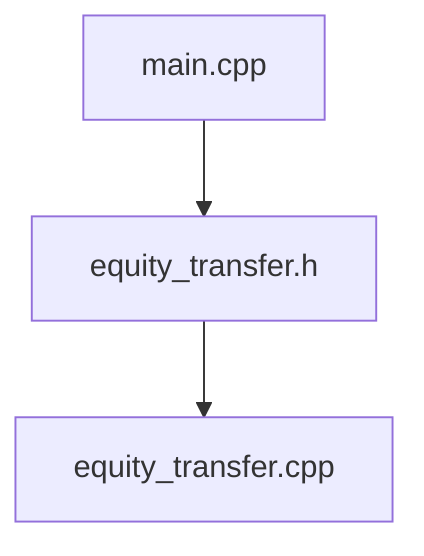

# Project 4

# 电子交易




## Makefile 的使用

1. `make` : 编译
2. `make clean`: 清除编译数据
3. `make t`, `make s`, `make l`: 三个测试对比
4. `make tar`: 打包`SJTU-UM JI`-JOJ所需文件

## 脚本代码

```bash
#!/bin/bash  

for((i=13;i<=66;i++))
do   
	echo ☺ $i.in is input file\! 
	./ll   -v -m -p -t -g TG -g GE -g GO -g nn< ./testfile/$i.in > ./output/l.txt
	./a    -v -m -p -t -g TG -g GE -g GO -g nn< ./testfile/$i.in > ./output/a.txt
	./main -v -m -p -t -g TG -g GE -g GO -g nn< ./testfile/$i.in > ./output/b.txt
	echo ✋ lxh \<\> hbc
	diff ./output/a.txt ./output/b.txt
	echo 🏠 lyh \<\> hbc
	diff ./output/l.txt ./output/b.txt;
done 
 

```


## 命令行输入

```bash
bash test.sh 
```


## testcase

来自TA的github，见`./testfile`。

## 命令行输出

```bash
☺ 13.in is input file!
✋ lxh <> hbc
🏠 lyh <> hbc
☺ 14.in is input file!
✋ lxh <> hbc
🏠 lyh <> hbc
☺ 15.in is input file!
✋ lxh <> hbc
🏠 lyh <> hbc
☺ 16.in is input file!
✋ lxh <> hbc
🏠 lyh <> hbc
☺ 17.in is input file!
✋ lxh <> hbc
🏠 lyh <> hbc
☺ 18.in is input file!
✋ lxh <> hbc
🏠 lyh <> hbc
☺ 19.in is input file!
✋ lxh <> hbc
🏠 lyh <> hbc
☺ 20.in is input file!
✋ lxh <> hbc
🏠 lyh <> hbc
☺ 21.in is input file!
✋ lxh <> hbc
🏠 lyh <> hbc
☺ 22.in is input file!
✋ lxh <> hbc
🏠 lyh <> hbc
☺ 23.in is input file!
✋ lxh <> hbc
🏠 lyh <> hbc
☺ 24.in is input file!
✋ lxh <> hbc
🏠 lyh <> hbc
☺ 25.in is input file!
✋ lxh <> hbc
🏠 lyh <> hbc
☺ 26.in is input file!
✋ lxh <> hbc
🏠 lyh <> hbc
☺ 27.in is input file!
✋ lxh <> hbc
🏠 lyh <> hbc
☺ 28.in is input file!
✋ lxh <> hbc
🏠 lyh <> hbc
☺ 29.in is input file!
✋ lxh <> hbc
32d31
< C bought 0 and sold 0 for a net transfer of $0
🏠 lyh <> hbc
32d31
< C bought 0 and sold 0 for a net transfer of $0
☺ 30.in is input file!
✋ lxh <> hbc
🏠 lyh <> hbc
☺ 31.in is input file!
✋ lxh <> hbc
7,8d6
< BUYER_1 bought 0 and sold 0 for a net transfer of $0
< SELLER_1 bought 0 and sold 0 for a net transfer of $0
🏠 lyh <> hbc
7,8d6
< BUYER_1 bought 0 and sold 0 for a net transfer of $0
< SELLER_1 bought 0 and sold 0 for a net transfer of $0
☺ 32.in is input file!
✋ lxh <> hbc
7d6
< BUYER_1 bought 0 and sold 0 for a net transfer of $0
🏠 lyh <> hbc
7d6
< BUYER_1 bought 0 and sold 0 for a net transfer of $0
☺ 33.in is input file!
✋ lxh <> hbc
7,8d6
< BUYER_1 bought 0 and sold 0 for a net transfer of $0
< SELLER_1 bought 0 and sold 0 for a net transfer of $0
🏠 lyh <> hbc
7,8d6
< BUYER_1 bought 0 and sold 0 for a net transfer of $0
< SELLER_1 bought 0 and sold 0 for a net transfer of $0
☺ 34.in is input file!
test.sh: line 6: ./testfile/34.in: No such file or directory
test.sh: line 7: ./testfile/34.in: No such file or directory
test.sh: line 8: ./testfile/34.in: No such file or directory
✋ lxh <> hbc
7,8d6
< BUYER_1 bought 0 and sold 0 for a net transfer of $0
< SELLER_1 bought 0 and sold 0 for a net transfer of $0
🏠 lyh <> hbc
7,8d6
< BUYER_1 bought 0 and sold 0 for a net transfer of $0
< SELLER_1 bought 0 and sold 0 for a net transfer of $0
☺ 35.in is input file!
✋ lxh <> hbc
🏠 lyh <> hbc
☺ 36.in is input file!
✋ lxh <> hbc
7d6
< SELLER_1 bought 0 and sold 0 for a net transfer of $0
🏠 lyh <> hbc
7d6
< SELLER_1 bought 0 and sold 0 for a net transfer of $0
☺ 37.in is input file!
✋ lxh <> hbc
🏠 lyh <> hbc
☺ 38.in is input file!
test.sh: line 6: ./testfile/38.in: No such file or directory
test.sh: line 7: ./testfile/38.in: No such file or directory
test.sh: line 8: ./testfile/38.in: No such file or directory
✋ lxh <> hbc
🏠 lyh <> hbc
☺ 39.in is input file!
✋ lxh <> hbc
🏠 lyh <> hbc
☺ 40.in is input file!
✋ lxh <> hbc
7d6
< SELLER_1 bought 0 and sold 0 for a net transfer of $0
🏠 lyh <> hbc
7d6
< SELLER_1 bought 0 and sold 0 for a net transfer of $0
☺ 41.in is input file!
✋ lxh <> hbc
🏠 lyh <> hbc
☺ 42.in is input file!
✋ lxh <> hbc
7,8d6
< BUYER_1 bought 0 and sold 0 for a net transfer of $0
< BUYER_2 bought 0 and sold 0 for a net transfer of $0
🏠 lyh <> hbc
7,8d6
< BUYER_1 bought 0 and sold 0 for a net transfer of $0
< BUYER_2 bought 0 and sold 0 for a net transfer of $0
☺ 43.in is input file!
✋ lxh <> hbc
🏠 lyh <> hbc
☺ 44.in is input file!
✋ lxh <> hbc
🏠 lyh <> hbc
☺ 45.in is input file!
✋ lxh <> hbc
8,9d7
< BUYER_1 bought 0 and sold 0 for a net transfer of $0
< BUYER_2 bought 0 and sold 0 for a net transfer of $0
🏠 lyh <> hbc
8,9d7
< BUYER_1 bought 0 and sold 0 for a net transfer of $0
< BUYER_2 bought 0 and sold 0 for a net transfer of $0
☺ 46.in is input file!
✋ lxh <> hbc
🏠 lyh <> hbc
☺ 47.in is input file!
✋ lxh <> hbc
7,8d6
< SELLER_1 bought 0 and sold 0 for a net transfer of $0
< SELLER_2 bought 0 and sold 0 for a net transfer of $0
🏠 lyh <> hbc
7,8d6
< SELLER_1 bought 0 and sold 0 for a net transfer of $0
< SELLER_2 bought 0 and sold 0 for a net transfer of $0
☺ 48.in is input file!
test.sh: line 6: ./testfile/48.in: No such file or directory
test.sh: line 7: ./testfile/48.in: No such file or directory
test.sh: line 8: ./testfile/48.in: No such file or directory
✋ lxh <> hbc
7,8d6
< SELLER_1 bought 0 and sold 0 for a net transfer of $0
< SELLER_2 bought 0 and sold 0 for a net transfer of $0
🏠 lyh <> hbc
7,8d6
< SELLER_1 bought 0 and sold 0 for a net transfer of $0
< SELLER_2 bought 0 and sold 0 for a net transfer of $0
☺ 49.in is input file!
✋ lxh <> hbc
🏠 lyh <> hbc
☺ 50.in is input file!
✋ lxh <> hbc
7,10d6
< BUYER_1 bought 0 and sold 0 for a net transfer of $0
< BUYER_2 bought 0 and sold 0 for a net transfer of $0
< BUYER_3 bought 0 and sold 0 for a net transfer of $0
< BUYER_4 bought 0 and sold 0 for a net transfer of $0
🏠 lyh <> hbc
7,10d6
< BUYER_1 bought 0 and sold 0 for a net transfer of $0
< BUYER_2 bought 0 and sold 0 for a net transfer of $0
< BUYER_3 bought 0 and sold 0 for a net transfer of $0
< BUYER_4 bought 0 and sold 0 for a net transfer of $0
☺ 51.in is input file!
✋ lxh <> hbc
8,10d7
< SELLER_1 bought 0 and sold 0 for a net transfer of $0
< SELLER_2 bought 0 and sold 0 for a net transfer of $0
< SELLER_3 bought 0 and sold 0 for a net transfer of $0
🏠 lyh <> hbc
8,10d7
< SELLER_1 bought 0 and sold 0 for a net transfer of $0
< SELLER_2 bought 0 and sold 0 for a net transfer of $0
< SELLER_3 bought 0 and sold 0 for a net transfer of $0
☺ 52.in is input file!
✋ lxh <> hbc
🏠 lyh <> hbc
☺ 53.in is input file!
✋ lxh <> hbc
🏠 lyh <> hbc
☺ 54.in is input file!
✋ lxh <> hbc
20d19
< SELLER_3 bought 0 and sold 0 for a net transfer of $0
🏠 lyh <> hbc
20d19
< SELLER_3 bought 0 and sold 0 for a net transfer of $0
☺ 55.in is input file!
✋ lxh <> hbc
7,10d6
< SELLER_1 bought 0 and sold 0 for a net transfer of $0
< SELLER_2 bought 0 and sold 0 for a net transfer of $0
< SELLER_3 bought 0 and sold 0 for a net transfer of $0
< SELLER_4 bought 0 and sold 0 for a net transfer of $0
🏠 lyh <> hbc
7,10d6
< SELLER_1 bought 0 and sold 0 for a net transfer of $0
< SELLER_2 bought 0 and sold 0 for a net transfer of $0
< SELLER_3 bought 0 and sold 0 for a net transfer of $0
< SELLER_4 bought 0 and sold 0 for a net transfer of $0
☺ 56.in is input file!
✋ lxh <> hbc
🏠 lyh <> hbc
☺ 57.in is input file!
✋ lxh <> hbc
🏠 lyh <> hbc
☺ 58.in is input file!
✋ lxh <> hbc
16d15
< SELLER_1 bought 0 and sold 0 for a net transfer of $0
18d16
< SELLER_3 bought 0 and sold 0 for a net transfer of $0
🏠 lyh <> hbc
16d15
< SELLER_1 bought 0 and sold 0 for a net transfer of $0
18d16
< SELLER_3 bought 0 and sold 0 for a net transfer of $0
☺ 59.in is input file!
✋ lxh <> hbc
🏠 lyh <> hbc
☺ 60.in is input file!
✋ lxh <> hbc
🏠 lyh <> hbc
☺ 61.in is input file!
✋ lxh <> hbc
🏠 lyh <> hbc
☺ 62.in is input file!
✋ lxh <> hbc
🏠 lyh <> hbc
☺ 63.in is input file!
✋ lxh <> hbc
🏠 lyh <> hbc
☺ 64.in is input file!
✋ lxh <> hbc
🏠 lyh <> hbc
☺ 65.in is input file!
✋ lxh <> hbc
🏠 lyh <> hbc
☺ 66.in is input file!
✋ lxh <> hbc
🏠 lyh <> hbc

```


## 格物

对于不一样的输出，需要好好修改。其中ll为TA的binary执行文件，a为某位满分的执行文件。main为你自己的执行文件。均在ubuntu下测试。