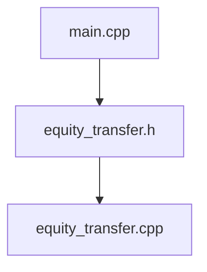

# Project 4

Bingcheng HU

516021910219


## File list




## Appendix

### `main.cpp`

```c++
#include <iostream>
#include <sstream>
#include <getopt.h>
#include "equity_transfer.h"

using namespace std;

int main(int argc, char *argv[]) {
    std::ios::sync_with_stdio(false);
    std::cin.tie(0);
    // First get the opcode
    bool verbose=false;
    bool midpoint=false;
    bool transfers=false;
    bool median=false;
    bool ttt=false;
    int ID=0;
    set<ttt_price *, ttt_equity> ttt_quity_set;
    int c;
    while (true) {
        const option long_options[] = {
                {"verbose",   no_argument,       NULL, 'v'},
                {"median",    no_argument,       NULL, 'm'},
                {"midpoint",  no_argument,       NULL, 'p'},
                {"transfers", no_argument,       NULL, 't'},
                {"ttt",       required_argument, NULL, 'g'},
                {0, 0, 0,                              0}
        };
        int option_index = 0;
        c = getopt_long(argc, argv, "vmptg:", long_options, &option_index);
        if (c == -1) break;
        switch (c) {
            case '?':
                cerr<<"???"<<endl;
                break;
            default:
                abort ();
            case 'v':
                verbose = true;
                break;
            case 'm':
                median = true;
                break;
            case 'p':
                midpoint = true;
                break;
            case 't':
                transfers = true;
                break;
            case 'g':
                ttt=true;
                auto equity_temp=new ttt_price;
                equity_temp->ID=ID;
                equity_temp->equity_symbol=optarg;
                equity_temp->timestamp_buy=-1;
                equity_temp->timestamp_sell=-1;
                equity_temp->price_buy=0;
                equity_temp->price_sell=0;
                ttt_quity_set.insert(equity_temp);
                ID++;
                break;

        }
    }
    int timestamp_now=0;
    int next_ID=0;
    int TIMESTAMP=0;
    string CLIENT_NAME;
    string BUY_OR_SELL;
    bool buy_signal=false;
    string EQUITY_SYMBOL;
    string limit_price;
    int LIMIT_PRICE=0;
    string quantity;
    int QUANTITY=0;
    int DURATION=0;
    int count_amount=0;
    int count=0;
    int count_transfer=0;
    int single_commission=0;
    int total_commission=0;

    map<string, equity_book> order_map;
    set<equity *, equity_buy> *order_buy_set=nullptr;
    set<equity *, equity_sell> *order_sell_set=nullptr;
    map<string, client_equity *> client_map;
    stringstream stream_temp;
    while(!cin.eof()) {
        string str;
        getline(cin, str);
        if(str.empty()) {
            break;
        }
        stream_temp.clear();
        stream_temp.str(str);
        stream_temp>>TIMESTAMP>>CLIENT_NAME>>BUY_OR_SELL>>EQUITY_SYMBOL>>limit_price>>quantity>>DURATION;;
        LIMIT_PRICE=atoi(limit_price.substr(1, limit_price.length()).c_str());
        QUANTITY=atoi(quantity.substr(1, quantity.length()).c_str());

        if(BUY_OR_SELL=="BUY") {
            buy_signal=true;
        }
        else if(BUY_OR_SELL=="SELL") {
            buy_signal=false;
        }
        else {
            exit(0);
        }

        auto client_equity_temp=new client_equity;
        client_equity_temp->name=CLIENT_NAME;
        client_equity_temp->buy_count=0;
        client_equity_temp->sell_count=0;
        client_equity_temp->net_count=0;
        client_map.insert(make_pair(CLIENT_NAME, (client_equity_temp)));


        for(auto tttEquity_equity_it=ttt_quity_set.begin();
            tttEquity_equity_it!=ttt_quity_set.end(); ++tttEquity_equity_it) {

            if((*tttEquity_equity_it)->equity_symbol==EQUITY_SYMBOL) {
                auto ttt_equity_pt=(*tttEquity_equity_it);
                if(buy_signal) {
                    if(ttt_equity_pt->timestamp_buy==-1) {
                        ttt_equity_pt->buy_flag=false;
                        break;
                    }
                    else if(ttt_equity_pt->timestamp_sell==-1||(ttt_equity_pt->price_sell<LIMIT_PRICE &&ttt_equity_pt->buy_flag==false)) {
                        ttt_equity_pt->price_sell=LIMIT_PRICE;
                        ttt_equity_pt->timestamp_sell=TIMESTAMP;
                        ttt_equity_pt->price_earn_max=ttt_equity_pt->price_sell-ttt_equity_pt->price_buy;
                        ttt_quity_set.insert(ttt_equity_pt);
                    } 
                    else if(ttt_equity_pt->buy_flag==true && (LIMIT_PRICE - ttt_equity_pt->price_buy_temp)>ttt_equity_pt->price_earn_max){
                        ttt_equity_pt->price_sell=LIMIT_PRICE;
                        ttt_equity_pt->timestamp_sell=TIMESTAMP;
                        ttt_equity_pt->timestamp_buy=ttt_equity_pt->timestamp_buy_temp;
                        ttt_equity_pt->price_buy=ttt_equity_pt->price_buy_temp;
                        ttt_equity_pt->price_earn_max=ttt_equity_pt->price_sell-ttt_equity_pt->price_buy;
                        ttt_equity_pt->buy_flag=false;
                        ttt_quity_set.insert(ttt_equity_pt);
                    }
                }
                else {
                    if(ttt_equity_pt->timestamp_buy==-1) {
                        ttt_equity_pt->price_buy=LIMIT_PRICE;
                        ttt_equity_pt->timestamp_buy=TIMESTAMP;
                        ttt_equity_pt->buy_flag=false;
                        ttt_equity_pt->price_earn_max=0;
                        ttt_quity_set.insert(ttt_equity_pt);
                    }
                    else if(ttt_equity_pt->price_buy>LIMIT_PRICE && ttt_equity_pt->timestamp_sell==-1){
                        ttt_equity_pt->timestamp_buy=TIMESTAMP;
                        ttt_equity_pt->price_buy=LIMIT_PRICE;
                    }
                    else if(ttt_equity_pt->price_buy>LIMIT_PRICE){
                        ttt_equity_pt->buy_flag=true;
                        ttt_equity_pt->timestamp_buy_temp=TIMESTAMP;
                        ttt_equity_pt->price_buy_temp=LIMIT_PRICE;
                    }
                }
            }
        }

        if(TIMESTAMP!=timestamp_now) {
            if(median) {
                get_median(order_map, timestamp_now);
            }
            if(midpoint) {
                get_midpoint(order_map, timestamp_now);
            }
            timestamp_now=TIMESTAMP;

            get_expire(order_map, order_buy_set, order_sell_set, timestamp_now);

        }

        auto order_all_iterator=order_map.find(EQUITY_SYMBOL);
        if(order_all_iterator==order_map.end()) {
            equity_book equitybook_temp=equity_book();
            equitybook_temp.EQUITY_SYMBOL=EQUITY_SYMBOL;
            order_all_iterator=order_map.insert(make_pair(EQUITY_SYMBOL, (equitybook_temp))).first;
        }

        if(buy_signal) {
            deal_buy(order_map, client_map, timestamp_now, order_all_iterator, QUANTITY, LIMIT_PRICE, next_ID,
                     transfers, CLIENT_NAME, verbose, EQUITY_SYMBOL, count_amount, count, count_transfer,
                     single_commission, total_commission);
        }
        else {
            deal_sell(order_map, client_map, timestamp_now, order_all_iterator, QUANTITY, LIMIT_PRICE, next_ID,
                      transfers, CLIENT_NAME, verbose, EQUITY_SYMBOL, count_amount, count, count_transfer,
                      single_commission, total_commission);
        }
        if(QUANTITY>0&&DURATION!=0) {
            auto Order_temp=new equity;
            Order_temp->ID=next_ID++;
            Order_temp->PRICE=LIMIT_PRICE;
            Order_temp->NAME=CLIENT_NAME;
            Order_temp->AMOUNT=QUANTITY;
            Order_temp->EXPIRE_TIME=(DURATION!=-1)?(timestamp_now+DURATION):-1;
            if(buy_signal) {
                order_buy_set=&(order_all_iterator->second.orderBuy);
                order_buy_set->insert(Order_temp);
            }
            else {
                order_sell_set=&(order_all_iterator->second.orderSell);
                order_sell_set->insert(Order_temp);
            }
        }
    }

    if(median) {
        get_median(order_map, timestamp_now);
    }

    if(midpoint) {
        get_midpoint(order_map, timestamp_now);
    }

    final_print(count_amount, count, count_transfer, total_commission);

    if(transfers) {
        get_transfers(client_map);
    }
    if(ttt) {
        for(auto tttEquity_record_it=ttt_quity_set.begin();
            tttEquity_record_it!=ttt_quity_set.end(); tttEquity_record_it++) {
            if((*tttEquity_record_it)->timestamp_buy<0||(*tttEquity_record_it)->timestamp_sell<0) {
                cout<<"Time travelers would buy "<<(*tttEquity_record_it)->equity_symbol<<" at time: "
                    <<-1<<" and sell it at time: "
                    <<-1<<endl;
                continue;
            }
            else {
                cout<<"Time travelers would buy "<<(*tttEquity_record_it)->equity_symbol<<" at time: "
                    <<(*tttEquity_record_it)->timestamp_buy<<" and sell it at time: "
                    <<(*tttEquity_record_it)->timestamp_sell<<endl;
            }
        }
    }
    return 0;
}
```

### `equity_transfer.h`

```c++
#ifndef EQUITY_TRANSFER_H
#define EQUITY_TRANSFER_H

#include <iostream>
#include <string>
#include <map>
#include <set>

using namespace std;

class equity {
public:
    int ID;
    string NAME;
    int AMOUNT;
    int PRICE;
    int EXPIRE_TIME;
};

struct equity_buy {
    bool operator()(const equity *a, const equity *b) const {
        if(a->PRICE>b->PRICE) {
            return true;
        }
        else if(a->PRICE==b->PRICE) {
            return a->ID<b->ID;
        }
        else {
            return false;
        }
    }
};

struct equity_sell {
    bool operator()(const equity *a, const equity *b) const {
        if(a->PRICE>b->PRICE) {
            return false;
        }
        else if(a->PRICE==b->PRICE) {
            return a->ID<b->ID;
        }
        else {
            return true;
        }
    }
};

class equity_book {
public:
    string EQUITY_SYMBOL;
    set<equity *, equity_buy> orderBuy;
    set<equity *, equity_sell> orderSell;
    multiset<int> history;
};

class ttt_price {
public:
    int ID;
    string equity_symbol;
    int timestamp_buy;
    int timestamp_sell;
    int price_buy;
    int price_sell;
    int price_buy_temp;
    int timestamp_buy_temp;
    int price_earn_max;
    bool buy_flag;
};

struct ttt_equity {
    bool operator()(const ttt_price *a, const ttt_price *b) const {
        return a->ID<b->ID;
    }
};

class client_equity {
public:
    string name="";
    int buy_count=0;
    int sell_count=0;
    int net_count=0;
};

void get_median(map<string, equity_book> &order_map, int timestamp_now);

void get_midpoint(map<string, equity_book> &order_list, int timestamp_now);

void get_transfers(map<string, client_equity *> &client_map);

void get_expire(map<string, equity_book> &order_list, set<equity *, equity_buy> *order_buy_set,
                set<equity *, equity_sell> *order_sell_set, int timestamp_now);

void deal_buy(map<string, equity_book> &order_list, map<string, client_equity *> &client_map, int timestamp_now,
              map<string, equity_book>::iterator order_all_iterator, int &QUANTITY, int LIMIT_PRICE, int next_ID,
              bool transfers, string &CLIENT_NAME, bool verbose, string &EQUITY_SYMBOL, int &NUMBER_OF_COMPLETED_TRADES,
              int &count, int &NUMBER_OF_SHARES_TRADED, int &COMMISION_EARNINGS, int &MONEY_TRANSFERRED);

void deal_sell(map<string, equity_book> &order_map, map<string, client_equity *> &client_map, int timestamp_now,
               map<string, equity_book>::iterator order_all_iterator, int &QUANTITY, int LIMIT_PRICE, int next_ID,
               bool transfers, string &CLIENT_NAME, bool verbose, string &EQUITY_SYMBOL, int &count_num,
               int &NUMBER_OF_COMPLETED_TRADES, int &NUMBER_OF_SHARES_TRADED, int &COMMISION_EARNINGS,
               int &MONEY_TRANSFERRED);

void final_print(int NUMBER_OF_SHARES_TRADED, int NUMBER_OF_COMPLETED_TRADES, int MONEY_TRANSFERRED,
                 int COMMISION_EARNINGS);

#endif
```

### `equity_transfer.cpp`

```c++
#include "equity_transfer.h"

using namespace std;

void get_median(map<string, equity_book> &order_map, int timestamp_now) {
    int median_price=0;
    for(auto orderAll_it=order_map.begin(); orderAll_it!=order_map.end(); ++orderAll_it) {
        ssize_t size=orderAll_it->second.history.size();
        if(size!=0) {
            bool even=(size%2==0);
            size/=2;
            auto median_price_it=orderAll_it->second.history.begin();
            for(auto i=0; i<size; ++i) {
                ++median_price_it;
            }
            if(!even) {
                median_price=*median_price_it;
            }
            else {
                median_price=((*median_price_it)+*(--median_price_it))/2;
            }
            cout<<"Median match price of "<<orderAll_it->second.EQUITY_SYMBOL<<" at time "<<timestamp_now<<" is $"
                <<median_price<<endl;
        }
        else {
            continue;
        }
    }
}

void get_midpoint(map<string, equity_book> &order_list, int timestamp_now) {
    for(auto orderAll_it=order_list.begin(); orderAll_it!=order_list.end(); ++orderAll_it) {
        if(orderAll_it->second.orderBuy.empty()||orderAll_it->second.orderSell.empty()) {
            cout<<"Midpoint of "<<orderAll_it->second.EQUITY_SYMBOL<<" at time "<<timestamp_now<<" is undefined"
                <<endl;
            continue;
        }
        auto midpoint_price=
                ((*orderAll_it->second.orderBuy.begin())->PRICE+(*orderAll_it->second.orderSell.begin())->PRICE)/2;
        cout<<"Midpoint of "<<orderAll_it->second.EQUITY_SYMBOL<<" at time "<<timestamp_now<<" is $"<<midpoint_price
            <<endl;
    }
}

void get_transfers(map<string, client_equity *> &client_map) {
    for(auto clientAll_it=client_map.begin(); clientAll_it!=client_map.end(); ++clientAll_it) {
        // if(clientAll_it->second->buy_count == 0 && clientAll_it->second->sell_count==0) continue;
        //cerr<<clientAll_it->second->buy_count <<"##"<< clientAll_it->second->sell_count<<endl;
        cout<<clientAll_it->second->name<<" bought "<<clientAll_it->second->buy_count<<" and sold "
            <<clientAll_it->second->sell_count<<" for a net transfer of $"<<clientAll_it->second->net_count<<endl;
    }
}

void get_expire(map<string, equity_book> &order_list, set<equity *, equity_buy> *order_buy_set,
                set<equity *, equity_sell> *order_sell_set, int timestamp_now) {
    set<equity *, equity_sell>::iterator Sell_set_it;
    set<equity *, equity_sell>::iterator Sell_set_it_temp;
    set<equity *, equity_buy>::iterator buy_set_it;
    set<equity *, equity_sell>::iterator buy_set_it_temp;
    for(auto orderAll_it=order_list.begin(); orderAll_it!=order_list.end(); ++orderAll_it) {
        order_sell_set=&(orderAll_it->second.orderSell);
        for(Sell_set_it=order_sell_set->begin(); Sell_set_it!=order_sell_set->end();) {
            if((*Sell_set_it)->EXPIRE_TIME!=-1&&(*Sell_set_it)->EXPIRE_TIME<=timestamp_now) {
                Sell_set_it_temp=Sell_set_it;
                Sell_set_it=order_sell_set->erase(Sell_set_it_temp);
            }
            else {
                ++Sell_set_it;
            }
        }
        order_buy_set=&(orderAll_it->second.orderBuy);
        for(buy_set_it=order_buy_set->begin(); buy_set_it!=order_buy_set->end();) { // bug here
            if((*buy_set_it)->EXPIRE_TIME!=-1&&(*buy_set_it)->EXPIRE_TIME<=timestamp_now) {
                buy_set_it_temp=buy_set_it;
                buy_set_it=order_buy_set->erase(buy_set_it_temp);
            }
            else {
                ++buy_set_it;
            }
        }
    }
}

void deal_buy(map<string, equity_book> &order_list, map<string, client_equity *> &client_map, int timestamp_now,
              map<string, equity_book>::iterator order_all_iterator, int &QUANTITY, int LIMIT_PRICE, int next_ID,
              bool transfers, string &CLIENT_NAME, bool verbose, string &EQUITY_SYMBOL, int &NUMBER_OF_COMPLETED_TRADES,
              int &count, int &NUMBER_OF_SHARES_TRADED, int &COMMISION_EARNINGS, int &MONEY_TRANSFERRED) {
    auto transact_price=0;

    auto orderSell_ptr=&(order_all_iterator->second.orderSell);

    while(QUANTITY>0&&!orderSell_ptr->empty()) {
        if((*orderSell_ptr->begin())->PRICE<=LIMIT_PRICE) {
            auto order_pt=*orderSell_ptr->begin();
            if(order_pt->ID>=next_ID) {
                transact_price=LIMIT_PRICE;
            }
            else {
                transact_price=order_pt->PRICE;
            }

            auto equitybook_ptr=&(order_all_iterator->second);
            equitybook_ptr->history.insert(transact_price);

            if(order_pt->AMOUNT>QUANTITY) {
                if(transfers) {
                    auto clientAll_it_1=client_map.find(CLIENT_NAME);
                    bool find_buyer=!(clientAll_it_1==client_map.end());

                    if(!find_buyer) {
                        auto client_record_temp=new client_equity;
                        client_record_temp->name=CLIENT_NAME;
                        client_record_temp->buy_count=QUANTITY;
                        client_record_temp->sell_count=0;
                        client_record_temp->net_count=QUANTITY*transact_price*(-1);
                        client_map.insert(make_pair(CLIENT_NAME, (client_record_temp)));
                    }
                    else {
                        auto client_map_pt_A=(clientAll_it_1->second);
                        client_map_pt_A->buy_count+=QUANTITY;
                        client_map_pt_A->net_count+=QUANTITY*transact_price*(-1);
                    }

                    auto client_map_it_B=client_map.find(order_pt->NAME);
                    bool find_seller=!(client_map_it_B==client_map.end());

                    if(!find_seller) {
                        auto client_record_temp=new client_equity;
                        client_record_temp->name=order_pt->NAME;
                        client_record_temp->buy_count=0;
                        client_record_temp->sell_count=QUANTITY;
                        client_record_temp->net_count=QUANTITY*transact_price;
                        client_map.insert(make_pair(order_pt->NAME, (client_record_temp)));
                    }
                    else {
                        auto clientAll_ptr_2=(client_map_it_B->second);
                        clientAll_ptr_2->sell_count+=QUANTITY;
                        clientAll_ptr_2->net_count+=QUANTITY*transact_price;
                    }
                }
                if(verbose) {
                    cout<<CLIENT_NAME<<" purchased "<<QUANTITY<<" shares of "<<EQUITY_SYMBOL<<" from "<<order_pt->NAME
                        <<" for $"<<transact_price<<"/share"<<endl;
                }
                ++count;
                NUMBER_OF_COMPLETED_TRADES+=QUANTITY;
                NUMBER_OF_SHARES_TRADED+=transact_price*QUANTITY;
                COMMISION_EARNINGS=(transact_price*QUANTITY)/100;
                MONEY_TRANSFERRED+=COMMISION_EARNINGS*2;
                order_pt->AMOUNT-=QUANTITY;
                QUANTITY=0;
            }
            else if(order_pt->AMOUNT==QUANTITY) {
                if(transfers) {
                    auto clientAll_it_1=client_map.find(CLIENT_NAME);
                    bool find_buyer=!(clientAll_it_1==client_map.end());

                    if(!find_buyer) {
                        auto client_record_temp=new client_equity;
                        client_record_temp->name=CLIENT_NAME;
                        client_record_temp->buy_count=QUANTITY;
                        client_record_temp->sell_count=0;
                        client_record_temp->net_count=QUANTITY*transact_price*(-1);
                        client_map.insert(make_pair(CLIENT_NAME, (client_record_temp)));
                    }
                    else {
                        auto client_map_pt_A=(clientAll_it_1->second);
                        client_map_pt_A->buy_count+=QUANTITY;
                        client_map_pt_A->net_count+=QUANTITY*transact_price*(-1);
                    }

                    auto client_map_it_B=client_map.find(order_pt->NAME);
                    bool find_seller=!(client_map_it_B==client_map.end());

                    if(!find_seller) {
                        auto client_record_temp=new client_equity;
                        client_record_temp->name=order_pt->NAME;
                        client_record_temp->buy_count=0;
                        client_record_temp->sell_count=QUANTITY;
                        client_record_temp->net_count=QUANTITY*transact_price;
                        client_map.insert(make_pair(order_pt->NAME, (client_record_temp)));
                    }
                    else {
                        auto clientAll_ptr_2=(client_map_it_B->second);
                        clientAll_ptr_2->sell_count+=QUANTITY;
                        clientAll_ptr_2->net_count+=QUANTITY*transact_price;
                    }
                }
                if(verbose) {
                    cout<<CLIENT_NAME<<" purchased "<<QUANTITY<<" shares of "<<EQUITY_SYMBOL<<" from "<<order_pt->NAME
                        <<" for $"<<transact_price<<"/share"<<endl;
                }
                ++count;
                NUMBER_OF_COMPLETED_TRADES+=QUANTITY;
                NUMBER_OF_SHARES_TRADED+=transact_price*QUANTITY;
                COMMISION_EARNINGS=(transact_price*QUANTITY)/100;
                MONEY_TRANSFERRED+=COMMISION_EARNINGS*2;
                QUANTITY=0;
                orderSell_ptr->erase(orderSell_ptr->begin());
            }
            else {
                if(transfers) {
                    auto clientAll_it_1=client_map.find(CLIENT_NAME);
                    bool find_buyer=!(clientAll_it_1==client_map.end());

                    if(!find_buyer) {
                        auto client_record_temp=new client_equity;
                        client_record_temp->name=CLIENT_NAME;
                        client_record_temp->buy_count=order_pt->AMOUNT;
                        client_record_temp->sell_count=0;
                        client_record_temp->net_count=order_pt->AMOUNT*transact_price*(-1);
                        client_map.insert(make_pair(CLIENT_NAME, (client_record_temp)));
                    }
                    else {
                        auto clientAll_ptr=(clientAll_it_1->second);
                        clientAll_ptr->buy_count+=order_pt->AMOUNT;
                        clientAll_ptr->net_count+=order_pt->AMOUNT*transact_price*(-1);
                    }

                    auto client_map_it_B=client_map.find(order_pt->NAME);
                    bool find_seller=!(client_map_it_B==client_map.end());

                    if(!find_seller) {
                        auto client_record_temp=new client_equity;
                        client_record_temp->name=order_pt->NAME;
                        client_record_temp->buy_count=0;
                        client_record_temp->sell_count=order_pt->AMOUNT;
                        client_record_temp->net_count=order_pt->AMOUNT*transact_price;
                        client_map.insert(make_pair(order_pt->NAME, (client_record_temp)));
                    }
                    else {
                        auto clientAll_ptr_2=(client_map_it_B->second);
                        clientAll_ptr_2->sell_count+=order_pt->AMOUNT;
                        clientAll_ptr_2->net_count+=order_pt->AMOUNT*transact_price;
                    }
                }
                if(verbose) {
                    cout<<CLIENT_NAME<<" purchased "<<order_pt->AMOUNT<<" shares of "<<EQUITY_SYMBOL<<" from "
                        <<order_pt->NAME<<" for $"<<transact_price<<"/share"<<endl;
                }
                NUMBER_OF_COMPLETED_TRADES+=order_pt->AMOUNT;
                ++count;
                NUMBER_OF_SHARES_TRADED+=transact_price*order_pt->AMOUNT;
                COMMISION_EARNINGS=transact_price*order_pt->AMOUNT/100;
                MONEY_TRANSFERRED+=COMMISION_EARNINGS*2;
                QUANTITY-=order_pt->AMOUNT;
                orderSell_ptr->erase(orderSell_ptr->begin());
            }
        }
        else {
            break;
        }
    }

}

void deal_sell(map<string, equity_book> &order_map, map<string, client_equity *> &client_map, int timestamp_now,
               map<string, equity_book>::iterator order_all_iterator, int &QUANTITY, int LIMIT_PRICE, int next_ID,
               bool transfers, string &CLIENT_NAME, bool verbose, string &EQUITY_SYMBOL, int &count_num,
               int &NUMBER_OF_COMPLETED_TRADES, int &NUMBER_OF_SHARES_TRADED, int &COMMISION_EARNINGS,
               int &MONEY_TRANSFERRED) {
    auto transact_price=0;
    auto orderBuy_ptr=&(order_all_iterator->second.orderBuy);
    while(QUANTITY>0&&!orderBuy_ptr->empty()) {
        if((*orderBuy_ptr->begin())->PRICE>=LIMIT_PRICE) {
            auto order_pt=*orderBuy_ptr->begin();
            if(order_pt->ID>=next_ID) {
                transact_price=LIMIT_PRICE;
            }
            else {
                transact_price=order_pt->PRICE;
            }
            auto equitybook_ptr=&(order_all_iterator->second);
            equitybook_ptr->history.insert(transact_price);
            if(order_pt->AMOUNT>QUANTITY) {
                if(transfers) {
                    auto clientAll_it_1=client_map.find(CLIENT_NAME);
                    bool find_seller=!(clientAll_it_1==client_map.end());

                    if(!find_seller) {
                        auto client_record_temp=new client_equity;
                        client_record_temp->name=CLIENT_NAME;
                        client_record_temp->buy_count=0;
                        client_record_temp->sell_count=QUANTITY;
                        client_record_temp->net_count=QUANTITY*transact_price*(1);
                        client_map.insert(make_pair(CLIENT_NAME, (client_record_temp)));
                    }
                    else {
                        auto client_map_pt_A=(clientAll_it_1->second);
                        client_map_pt_A->sell_count+=QUANTITY;
                        client_map_pt_A->net_count+=QUANTITY*transact_price*(1);
                    }

                    auto client_map_it_B=client_map.find(order_pt->NAME);
                    bool find_buyer=!(client_map_it_B==client_map.end());

                    if(!find_buyer) {
                        auto client_record_temp=new client_equity;
                        client_record_temp->name=order_pt->NAME;
                        client_record_temp->buy_count=QUANTITY;
                        client_record_temp->sell_count=0;
                        client_record_temp->net_count=QUANTITY*transact_price*(-1);
                        client_map.insert(make_pair(order_pt->NAME, (client_record_temp)));
                    }
                    else {
                        auto clientAll_ptr_2=(client_map_it_B->second);
                        clientAll_ptr_2->buy_count+=QUANTITY;
                        clientAll_ptr_2->net_count+=QUANTITY*transact_price*(-1);
                    }
                }
                if(verbose) {
                    cout<<order_pt->NAME<<" purchased "<<QUANTITY<<" shares of "<<EQUITY_SYMBOL<<" from "<<CLIENT_NAME
                        <<" for $"<<transact_price<<"/share"<<endl;
                }
                count_num+=QUANTITY;
                ++NUMBER_OF_COMPLETED_TRADES;
                NUMBER_OF_SHARES_TRADED+=transact_price*QUANTITY;
                COMMISION_EARNINGS=transact_price*QUANTITY/100;
                MONEY_TRANSFERRED+=COMMISION_EARNINGS*2;
                order_pt->AMOUNT-=QUANTITY;
                QUANTITY=0;
            }
            else if(order_pt->AMOUNT==QUANTITY) {
                if(transfers) {
                    auto clientAll_it_1=client_map.find(CLIENT_NAME);
                    bool find_seller=!(clientAll_it_1==client_map.end());


                    if(!find_seller) {
                        auto client_record_temp=new client_equity;
                        client_record_temp->name=CLIENT_NAME;
                        client_record_temp->buy_count=0;
                        client_record_temp->sell_count=QUANTITY;
                        client_record_temp->net_count=QUANTITY*transact_price*(1);
                        client_map.insert(make_pair(CLIENT_NAME, (client_record_temp)));
                    }
                    else {
                        auto client_map_pt_A=(clientAll_it_1->second);
                        client_map_pt_A->sell_count+=QUANTITY;
                        client_map_pt_A->net_count+=QUANTITY*transact_price*(1);
                    }

                    auto client_map_it_B=client_map.find(order_pt->NAME);
                    bool find_buyer=!(client_map_it_B==client_map.end());


                    if(!find_buyer) {
                        auto client_record_temp=new client_equity;
                        client_record_temp->name=order_pt->NAME;
                        client_record_temp->buy_count=QUANTITY;
                        client_record_temp->sell_count=0;
                        client_record_temp->net_count=QUANTITY*transact_price*(-1);
                        client_map.insert(make_pair(order_pt->NAME, (client_record_temp)));
                    }
                    else {
                        auto clientAll_ptr_2=(client_map_it_B->second);
                        clientAll_ptr_2->buy_count+=QUANTITY;
                        clientAll_ptr_2->net_count+=QUANTITY*transact_price*(-1);
                    }
                }
                if(verbose) {

                    cout<<order_pt->NAME<<" purchased "<<QUANTITY<<" shares of "<<EQUITY_SYMBOL<<" from "<<CLIENT_NAME
                        <<" for $"<<transact_price<<"/share"<<endl;
                }
                count_num+=QUANTITY;
                ++NUMBER_OF_COMPLETED_TRADES;
                COMMISION_EARNINGS=transact_price*QUANTITY/100;
                MONEY_TRANSFERRED+=COMMISION_EARNINGS*2;
                NUMBER_OF_SHARES_TRADED+=transact_price*QUANTITY;
                QUANTITY=0;
                orderBuy_ptr->erase(orderBuy_ptr->begin());
            }
            else {
                if(transfers) {
                    auto clientAll_it_1=client_map.find(CLIENT_NAME);
                    bool find_seller=!(clientAll_it_1==client_map.end());

                    if(!find_seller) {
                        auto client_record_temp=new client_equity;
                        client_record_temp->name=CLIENT_NAME;
                        client_record_temp->buy_count=0;
                        client_record_temp->sell_count=order_pt->AMOUNT;
                        client_record_temp->net_count=order_pt->AMOUNT*transact_price*(1);
                        client_map.insert(make_pair(CLIENT_NAME, (client_record_temp)));
                    }
                    else {
                        auto client_map_pt_A=(clientAll_it_1->second);
                        client_map_pt_A->sell_count+=order_pt->AMOUNT;
                        client_map_pt_A->net_count+=order_pt->AMOUNT*transact_price*(1);
                    }

                    auto client_map_it_B=client_map.find(order_pt->NAME);
                    bool find_buyer=!(client_map_it_B==client_map.end());

                    if(!find_buyer) {
                        auto client_record_temp=new client_equity;
                        client_record_temp->name=order_pt->NAME;
                        client_record_temp->buy_count=order_pt->AMOUNT;
                        client_record_temp->sell_count=0;
                        client_record_temp->net_count=order_pt->AMOUNT*transact_price*(-1);
                        client_map.insert(make_pair(order_pt->NAME, (client_record_temp)));
                    }
                    else {
                        auto clientAll_ptr_2=(client_map_it_B->second);
                        clientAll_ptr_2->buy_count+=order_pt->AMOUNT;
                        clientAll_ptr_2->net_count+=order_pt->AMOUNT*transact_price*(-1);
                    }
                }
                if(verbose) {
                    cout<<order_pt->NAME<<" purchased "<<order_pt->AMOUNT<<" shares of "<<EQUITY_SYMBOL<<" from "
                        <<CLIENT_NAME<<" for $"<<transact_price<<"/share"<<endl;
                }
                count_num+=order_pt->AMOUNT;
                ++NUMBER_OF_COMPLETED_TRADES;
                NUMBER_OF_SHARES_TRADED+=transact_price*order_pt->AMOUNT;
                COMMISION_EARNINGS=transact_price*order_pt->AMOUNT/100;
                MONEY_TRANSFERRED+=COMMISION_EARNINGS*2;
                QUANTITY-=order_pt->AMOUNT;
                orderBuy_ptr->erase(orderBuy_ptr->begin());
            }
        }
        else {
            break;
        }
    }

}

void final_print(int NUMBER_OF_SHARES_TRADED, int NUMBER_OF_COMPLETED_TRADES, int MONEY_TRANSFERRED,
                 int COMMISION_EARNINGS) {
    cout<<"---End of Day---\n"<<"Commission Earnings: $"<<COMMISION_EARNINGS
    <<"\nTotal Amount of Money Transferred: $"<<MONEY_TRANSFERRED
    <<"\nNumber of Completed Trades: "<<NUMBER_OF_COMPLETED_TRADES
    <<"\nNumber of Shares Traded: "<<NUMBER_OF_SHARES_TRADED<<endl;
}
```

