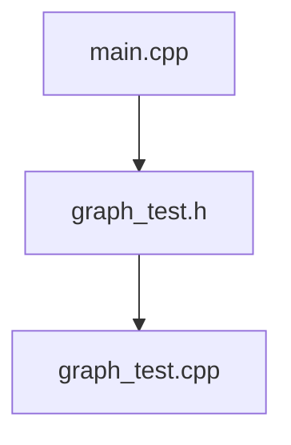

# Project 5

Bingcheng HU

516021910219

## File list



## Memory leakage check

```vb
==4179== HEAP SUMMARY:
==4179==     in use at exit: 195,584 bytes in 7 blocks
==4179==   total heap usage: 77 allocs, 70 frees, 198,848 bytes allocated
==4179== 
==4179== LEAK SUMMARY:
==4179==    definitely lost: 0 bytes in 0 blocks
==4179==    indirectly lost: 0 bytes in 0 blocks
==4179==      possibly lost: 0 bytes in 0 blocks
==4179==    still reachable: 195,584 bytes in 7 blocks
==4179==         suppressed: 0 bytes in 0 blocks
```

## JOJ passed


## Appendix

### 1. Main.cpp

```c++
#include <iostream>
#include "graph_test.h"

using namespace std;

int main() {
    ios::sync_with_stdio(false);
    cin.tie(0);
    int node_num;
    cin >> node_num;
    Graph graph = Graph();
    for (int i = 0; i < node_num; i++) {
        graph.node_vec.push_back(new Node);
    }
    while (!cin.eof()) {
        int node_start_code, node_end_code;
        Edge edge_temp;
        cin >> node_start_code;
        if (cin.eof()) break;
        cin >> node_end_code >> edge_temp.weight;
        set_graph(graph, edge_temp, node_start_code, node_end_code);
    }
    tell_DAG(graph);
    calculate_MST(graph);
    // to avoid memory leak, we need to delete nodes.
    for (int i = 0; i < node_num; i++) {
        delete graph.node_vec.back();
        graph.node_vec.pop_back();
    }
    return 0;
}
```

### 2. graph_test.h

```c++
#ifndef GRAPH_TEST_H
#define GRAPH_TEST_H
#define INFINITY INT_MAX

#include <iostream>
#include <sstream>
#include <algorithm>
#include <climits>
#include <list>
#include <set>
#include <map>
#include <deque>
#include <vector>

using namespace std;
struct Node;
struct Edge;

struct Node {
    int degree = 0;
    int order_num = 0;
    int smallest_weight = 0;
    list<Edge> adjacent;
    list<Edge> undirected;
};

struct Edge {
    int weight = 0;
    Node *distinction;
};

struct Edge_comp {
    bool operator()(const Node *a, const Node *b) const {
        return b->order_num > a->order_num;
    }
};

struct Graph {
    vector<Node *> node_vec;
    multimap<Node *, Edge, Edge_comp> edge_map;
    multimap<Node *, Edge, Edge_comp> undirected_edge_map;
};

struct smallest_weight_comp {
    bool operator()(const Node *a, const Node *b) const {
        return b->smallest_weight > a->smallest_weight;
    }
};

bool degree_comp(const Node *a, const Node *b);

bool order_comp(const Node *a, const Node *b);

void set_graph(Graph &graph, Edge &edge_temp, int node_start_code, int node_end_code);

void tell_DAG(Graph graph);

void calculate_MST(Graph graph);

#endif
```

### 3. graph_test.cpp

```c++
#include <iostream>

#include "graph_test.h"

using namespace std;

bool degree_comp(const Node *a, const Node *b) {
    return a->degree < b->degree;
}

bool order_comp(const Node *a, const Node *b) {
    return a->order_num < b->order_num;
}

static void printDAG(bool isDAG) {
    if (!isDAG) {
        cout << "The graph is not a DAG" << endl;
    } else {
        cout << "The graph is a DAG" << endl;
    }
}

static void printMST(bool MST_exist, int weight_all){
    if (!MST_exist) {
        cout << "The total weight of MST is " << weight_all << endl;
    } else {
        cout << "No MST exists!" << endl;
    }
}

void set_graph(Graph &graph, Edge &edge_temp, int node_start_code, int node_end_code){
    Edge edge_undirected_I;
    Edge edge_undirected_II;
    edge_undirected_I.weight = edge_undirected_II.weight = edge_temp.weight;
    graph.node_vec[node_start_code]->order_num = node_start_code;
    graph.node_vec[node_end_code]->order_num = node_end_code;
    graph.node_vec[node_end_code]->degree++;
    graph.node_vec[node_end_code]->smallest_weight = 0;
    graph.node_vec[node_start_code]->smallest_weight = graph.node_vec[node_end_code]->smallest_weight;
    edge_temp.distinction = graph.node_vec[node_end_code];
    edge_undirected_I.distinction = graph.node_vec[node_end_code];
    edge_undirected_II.distinction = graph.node_vec[node_start_code];
    graph.node_vec[node_start_code]->adjacent.push_back(edge_temp);
    graph.node_vec[node_start_code]->undirected.push_back(edge_undirected_I);
    graph.node_vec[node_end_code]->undirected.push_back(edge_undirected_II);
    graph.edge_map.insert(make_pair(graph.node_vec[node_start_code], edge_temp));
    graph.undirected_edge_map.insert(make_pair(graph.node_vec[node_start_code], edge_undirected_I));
    graph.undirected_edge_map.insert(make_pair(graph.node_vec[node_end_code], edge_undirected_II));
}

void tell_DAG(Graph graph) {
    std::sort(graph.node_vec.begin(), graph.node_vec.end(), degree_comp);
    vector<Node *> S;
    for (auto &it : graph.node_vec) {
        if (it->degree == 0) {
            S.push_back(it);
        } else {
            break;
        }
    }
    std::sort(graph.node_vec.begin(), graph.node_vec.end(), order_comp);
    while (!S.empty()) {
        auto n = *S.begin();
        S.erase(S.begin());
        for (auto it = n->adjacent.begin(); it != n->adjacent.end(); ++it) {
            auto m = it->distinction;
            for (auto tt = graph.edge_map.begin(); tt != graph.edge_map.end(); ++tt) {
                if (tt->first == n && tt->second.distinction == m) {
                    graph.edge_map.erase(tt);
                    break;
                }
            }
            m->degree--;
            if (!m->degree) {
                S.push_back(m);
            }
        }
    }
    printDAG(graph.edge_map.empty());
}

void calculate_MST(Graph graph) {
    multiset<Node *, smallest_weight_comp> connected_nodes;
    multiset<Node *, smallest_weight_comp> disperse_nodes;
    std::sort(graph.node_vec.begin(),
              graph.node_vec.end(),
              order_comp);
    auto size = graph.node_vec.size();
    for (unsigned int i = 0; i < size; ++i) {
        graph.node_vec[i]->smallest_weight = INT_MAX;
    }
    graph.node_vec[0]->smallest_weight = 0;
    connected_nodes.clear();
    for (unsigned int i = 0; i < size; ++i) {
        disperse_nodes.insert(graph.node_vec[i]);
    }
    int weight_all = 0;
    bool MST_exist = false;
    while (!disperse_nodes.empty()) {
        auto v = *disperse_nodes.begin();
        if (v->smallest_weight == INT_MAX) {
            MST_exist = true;
            break;
        }
        weight_all += v->smallest_weight;
        connected_nodes.insert(v);
        disperse_nodes.erase(disperse_nodes.begin());
        for (auto undirected_list_it = v->undirected.begin(); undirected_list_it != v->undirected.end();
             ++undirected_list_it) {
            auto u = undirected_list_it->distinction;
            for (auto disperse_nodes_it = disperse_nodes.begin(); disperse_nodes_it != disperse_nodes.end();
                ++disperse_nodes_it) {
                if ((*disperse_nodes_it) == u) {
                    auto it_u = disperse_nodes_it;
                    int current_weight = 0;
                    for (auto it = graph.undirected_edge_map.begin(); it != graph.undirected_edge_map.end();) {
                        if (it->second.distinction == u && it->first == v) {
                            current_weight = it->second.weight;
                            it = graph.undirected_edge_map.erase(it);
                            break;
                        } else {
                            it++;
                        }
                    }
                    if (u->smallest_weight > current_weight) {
                        u->smallest_weight = current_weight;
                    }
                    for (auto it = graph.undirected_edge_map.begin(); it != graph.undirected_edge_map.end();) {
                        if (it->first == u && it->second.distinction == v) {
                            it = graph.undirected_edge_map.erase(it);
                            break;
                        } else {
                            it++;
                        }
                    }
                    for (auto it = u->undirected.begin(); it != u->undirected.end();) {
                        if (it->distinction == v) {
                            it = u->undirected.erase(it);
                            break;
                        } else {
                            it++;
                        }
                    }
                    disperse_nodes.erase(it_u);
                    disperse_nodes.insert(u);
                    break;
                }
            }
        }
    }
    printMST(MST_exist, weight_all);
}
```


