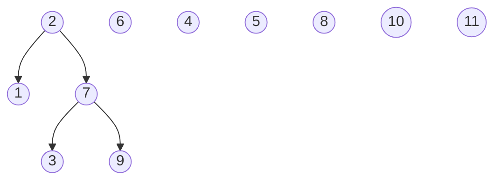
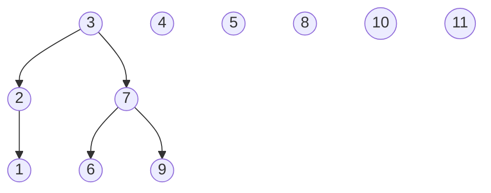
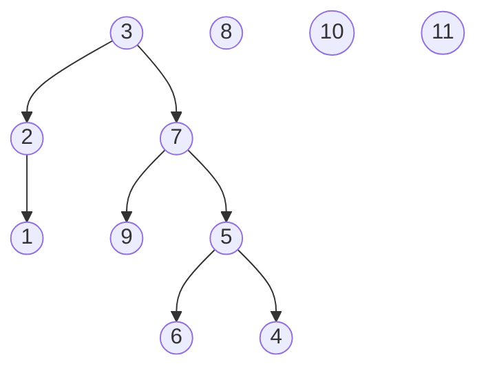

# VE281 Written Assignment 6

Bingcheng HU

516021910219

##Q1.

### (a) 

```mermaid
graph TD;
	%% red node
	classDef black fill:#DCDCDC,stroke:#333,stroke-width:4px;
	%% black node
	classDef red fill:#FF4500,stroke:#FF9,stroke-width:1px;
	%% list all nodes
	%% Q1
	a((2))
	b((1))
	c((3))
	d((7))
	e((9))
	%% Q2
	f((6))
	%% Q3
	g((4))
	h((5))
	%% Q4
	i((8))
	j((10))
	k((11))
	%% def tree connection
	a-->b;
	a-->d;
	d-->c;
	d-->e;
	%% def style of nodes
	%% class 3,7 black
	%% class 1,9 red
```

### (b)

```mermaid
graph TD;
	%% red node
	classDef black fill:#DCDCDC,stroke:#333,stroke-width:4px;
	%% black node
	classDef red fill:#FF4500,stroke:#FF9,stroke-width:1px;
	%% list all nodes
	%% Q1
	a((2))
	b((1))
	c((3))
	d((7))
	e((9))
	%% Q2
	f((6))
	%% Q3
	g((4))
	h((5))
	%% Q4
	i((8))
	j((10))
	k((11))
	%% def tree connection
	c-->a;
	c-->d;
	a-->b;
	d-->f;
	d-->e;
	%% def style of nodes
	%% class 3,7 black
	%% class 1,9 red
```

### (c)

```mermaid
graph TD;
	%% red node
	classDef black fill:#DCDCDC,stroke:#333,stroke-width:4px;
	%% black node
	classDef red fill:#FF4500,stroke:#FF9,stroke-width:1px;
	%% list all nodes
	%% Q1
	a((2))
	b((1))
	c((3))
	d((7))
	e((9))
	%% Q2
	f((6))
	%% Q3
	g((4))
	h((5))
	%% Q4
	i((8))
	j((10))
	k((11))
	%% def tree connection
	c-->a;
	c-->d;
	a-->b;
	d-->h;
	d-->e;
	h-->f;
	h-->g;
	%% def style of nodes
	%% class 3,7 black
	%% class 1,9 red
```

### (d)

### (e)

## Q2.

## Q3.

## Q4.

