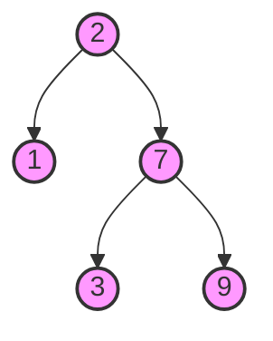

```mermaid
graph TD;
	%% default node
	classDef default fill:#f9f,stroke:#333,stroke-width:2px;
	%% red node
	%%classDef black fill:#DCDCDC,stroke:#333,stroke-width:4px;
	%% black node
	%%classDef red fill:#FF4500,stroke:#FF9,stroke-width:1px;
	%% list all nodes
	2((2))
	1((1))
	3((3))
	7((7))
	9((9))
	%% def tree connection
	2-->1;
	2-->7;
	7-->3;
	7-->9;
	%% def style of nodes
	%%class 3,7 black
	%%class 1,9 red
```

